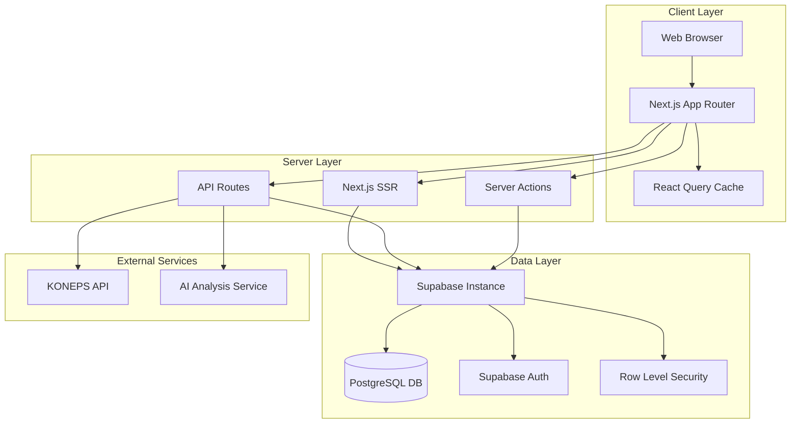
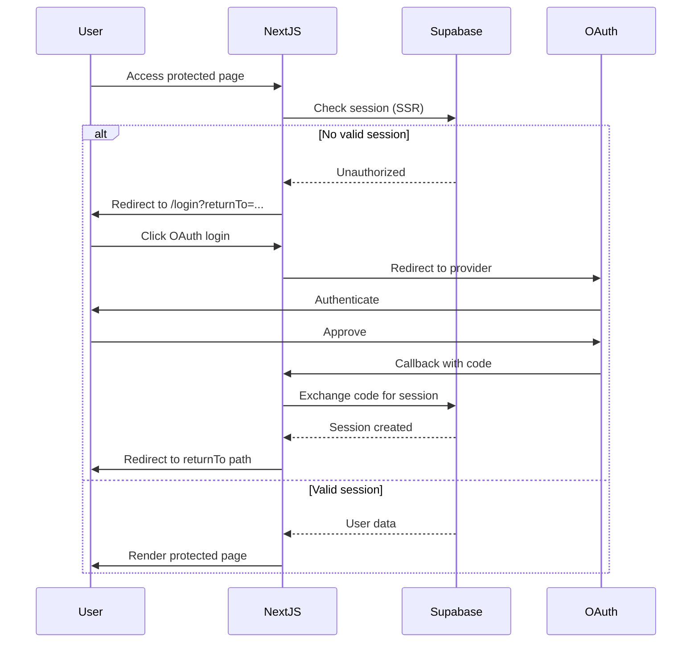

# Design Document: Flutter to Next.js Web Expansion

## Overview

PlayBid는 나라장터(KONEPS) 입찰 공고 데이터를 기반으로 검색, 분석, 모의입찰, 학습 기능을 제공하는 입찰 지원 플랫폼입니다. 본 설계는 기존 Flutter 모바일 앱의 핵심 기능을 Next.js 기반 웹 애플리케이션으로 확장하여 데스크톱 환경의 실무 사용자에게 최적화된 경험을 제공합니다.

### 핵심 목표

1. **데스크톱 최적화**: 넓은 화면을 활용한 정보 밀도 높은 UI 제공
2. **기존 시스템 호환성**: Flutter 앱과 동일한 Supabase 데이터베이스 공유
3. **전문가 워크플로우**: 입찰 실무자의 효율적인 작업 흐름 지원
4. **유료 기능 통합**: AI 분석, 통계, 계산기 등 프리미엄 서비스 제공

### 기술 스택

- **Frontend**: Next.js 14 (App Router), React 18, TypeScript
- **Styling**: Tailwind CSS, shadcn/ui components
- **Backend**: Supabase (PostgreSQL, Auth, RLS)
- **Deployment**: Vultr VPS (self-hosted Supabase)
- **State Management**: React Query (TanStack Query)
- **Forms**: React Hook Form + Zod validation

## Architecture

### 시스템 아키텍처




### 레이어 구조

1. **Presentation Layer**: React 컴포넌트, 페이지, 레이아웃
2. **Business Logic Layer**: Server Actions, API Routes, 유틸리티 함수
3. **Data Access Layer**: Supabase 클라이언트, 쿼리 함수
4. **Database Layer**: PostgreSQL with RLS policies

### 인증 흐름




## Components and Interfaces

### 페이지 구조


```
/
├── (auth)
│   ├── login
│   └── auth-callback
├── (main)
│   ├── dashboard
│   ├── bid_notice
│   │   └── detail
│   ├── bid_opening
│   │   └── detail
│   ├── bid_history
│   │   └── analysis
│   ├── challenge
│   │   ├── missions
│   │   ├── ranking
│   │   └── badges
│   ├── learning
│   │   ├── quiz
│   │   └── flashcard
│   ├── profile
│   │   ├── bookmarks
│   │   ├── notifications
│   │   ├── payment
│   │   └── subscription
│   ├── point-history
│   └── qualification-calculator
└── api
    ├── paid-features
    ├── sync
    ├── notifications
    └── webhooks
```

Flutter 앱 경로 계약과의 정합성을 위해 웹은 위 경로를 기본으로 사용하고, 필요 시 사용자 친화 별칭 경로(`/notices`, `/results` 등)는 rewrite/alias로만 제공합니다.

### 핵심 컴포넌트

#### 1. Layout Components

- **AppShell**: 전체 레이아웃 래퍼 (사이드바 + 메인 콘텐츠)
- **Sidebar**: 네비게이션 메뉴 (데스크톱/태블릿/모바일 반응형)
- **Header**: 검색바, 알림, 프로필 드롭다운
- **MobileNav**: 모바일 하단 네비게이션

#### 2. Feature Components

- **NoticeCard**: 입찰공고 카드 (리스트/그리드 뷰)
- **NoticeDetail**: 공고 상세 정보 표시
- **MockBidForm**: 모의입찰 입력 폼
- **ResultCard**: 개찰결과 카드
- **BookmarkButton**: 북마크 토글 버튼
- **PremiumFeatureCard**: 유료 기능 진입 카드
- **DashboardWidget**: 대시보드 요약 위젯

#### 3. Shared Components

- **SearchBar**: 키워드 검색 입력
- **FilterPanel**: 필터 옵션 패널
- **DataTable**: 정렬/페이지네이션 테이블
- **LoadingSkeleton**: 로딩 스켈레톤
- **EmptyState**: 빈 상태 메시지
- **ErrorBoundary**: 에러 처리 경계

### API 인터페이스


#### Supabase Client API

```typescript
// 공고 조회
interface GetNoticesParams {
  keyword?: string;
  category?: string;
  priceMin?: number;
  priceMax?: number;
  deadline?: string;
  page: number;
  limit: number;
}

interface BidNotice {
  id: string;
  bid_ntce_no: string;
  bid_ntce_ord?: string;
  bid_ntce_nm: string;
  ntce_instt_nm?: string;
  dminstt_nm?: string;
  api_category?: 'construction' | 'service' | 'product';
  bid_ntce_dt?: string;
  bid_clse_dt?: string;
  openg_dt?: string;
  presmpt_prce?: number;
  cntrct_cncls_mthd_nm?: string;
  bid_methd_nm?: string;
  sucsfbid_mthd_nm?: string;
  sucsfbid_lwlt_rate?: number;
  created_at: string;
  updated_at: string;
}

// 북마크 관리
interface Bookmark {
  id: string;
  user_id: string;
  bid_notice_id: string;
  scrapped_at: string;
  scrap_reason?: string;
  bid_notices?: BidNotice;
}

// 모의입찰
interface MockBid {
  id: string;
  user_id: string;
  bid_notice_id: string;
  bid_ntce_no?: string;
  predicted_price: number;
  result_type: 'pending' | 'success' | 'fail' | 'void';
  prediction_made_at: string;
  actual_price?: number;
  accuracy_rate?: number;
  confidence_level?: number;
  prediction_reason?: string;
  metadata?: Record<string, any>;
  created_at: string;
}

// 알림
interface InAppNotification {
  id: string;
  user_id: string;
  type: string;
  title: string;
  body: string;
  read: boolean;
  deleted: boolean;
  bid_history_id?: string;
  data?: Record<string, any>;
  created_at: string;
}

// 유료 기능 실행
interface ExecutePaidFeatureParams {
  feature_type: 'ai_report' | 'participant_stats' | 'similar_rate_stats' | 'qualification_calc';
  target_id: string;
  input_params: Record<string, any>;
  idempotency_key: string;
}

interface PaidFeatureResult {
  id: string;
  user_id: string;
  feature_type: string;
  cost: number;
  result_data: Record<string, any>;
  model_version: string;
  created_at: string;
}
```

## Data Models

### 운영 기준 DDL (필수)

아래 DDL은 웹/Flutter 공용 운영 계약 기준입니다. 실제 마이그레이션은 이 구조를 기준으로만 작성합니다.

#### 공유 테이블 DDL (Flutter 앱과 공유, 운영 기준)

```sql
-- 입찰공고
CREATE TABLE bid_notices (
  id UUID PRIMARY KEY,
  bid_ntce_no VARCHAR(20) NOT NULL,
  bid_ntce_ord VARCHAR(10),
  bid_ntce_nm TEXT NOT NULL,
  api_category VARCHAR(30),              -- construction | service | product
  ntce_instt_nm TEXT,
  dminstt_nm TEXT,
  bid_ntce_dt TIMESTAMPTZ,
  bid_clse_dt TIMESTAMPTZ,
  openg_dt TIMESTAMPTZ,
  presmpt_prce BIGINT,
  bid_methd_nm TEXT,
  cntrct_cncls_mthd_nm TEXT,
  sucsfbid_mthd_nm TEXT,
  sucsfbid_lwlt_rate NUMERIC(6,3),
  bid_ntce_dtl_url TEXT,
  raw_data JSONB,
  created_at TIMESTAMPTZ DEFAULT NOW(),
  updated_at TIMESTAMPTZ DEFAULT NOW()
);

-- 개찰결과
CREATE TABLE bid_results (
  id UUID PRIMARY KEY,
  bid_ntce_no VARCHAR(20) NOT NULL,
  bid_ntce_ord VARCHAR(10),
  bid_category VARCHAR(30),              -- construction | service | goods
  bid_ntce_nm TEXT,
  ntce_instt_nm TEXT,
  dminstt_nm TEXT,
  openg_dt TIMESTAMPTZ,
  prtcpt_cnum INTEGER,
  progrs_div_cd_nm TEXT,
  openg_corp_info TEXT,
  metadata JSONB,
  created_at TIMESTAMPTZ DEFAULT NOW(),
  updated_at TIMESTAMPTZ DEFAULT NOW()
);

-- 사용자 프로필 (Auth 동기화)
CREATE TABLE profiles (
  id UUID PRIMARY KEY REFERENCES auth.users(id),
  email TEXT,
  username TEXT,
  full_name TEXT,
  avatar_url TEXT,
  created_at TIMESTAMPTZ DEFAULT NOW(),
  updated_at TIMESTAMPTZ DEFAULT NOW()
);

-- 사용자 확장 프로필
CREATE TABLE user_profiles (
  id UUID PRIMARY KEY REFERENCES auth.users(id),
  user_id UUID UNIQUE REFERENCES auth.users(id),
  nickname TEXT,
  phone TEXT,
  company TEXT,
  position TEXT,
  bio TEXT,
  preferences JSONB,
  avatar_url TEXT,
  career_years INTEGER,
  annual_bids_range TEXT,
  sectors TEXT[],
  created_at TIMESTAMPTZ DEFAULT NOW(),
  updated_at TIMESTAMPTZ DEFAULT NOW()
);

-- 북마크 (Flutter 계약: user_scraps)
CREATE TABLE user_scraps (
  id UUID PRIMARY KEY DEFAULT gen_random_uuid(),
  user_id UUID NOT NULL REFERENCES auth.users(id) ON DELETE CASCADE,
  bid_notice_id UUID NOT NULL REFERENCES bid_notices(id) ON DELETE CASCADE,
  scrapped_at TIMESTAMPTZ DEFAULT NOW(),
  scrap_reason TEXT,
  UNIQUE(user_id, bid_notice_id)
);

-- 모의입찰 이력
CREATE TABLE user_bid_history (
  id UUID PRIMARY KEY DEFAULT gen_random_uuid(),
  user_id UUID NOT NULL REFERENCES auth.users(id) ON DELETE CASCADE,
  bid_notice_id UUID REFERENCES bid_notices(id),
  bid_ntce_no VARCHAR(20),
  predicted_price BIGINT NOT NULL,
  result_type VARCHAR(20) DEFAULT 'pending', -- pending | success | fail | void
  prediction_made_at TIMESTAMPTZ DEFAULT NOW(),
  actual_price BIGINT,
  accuracy_rate NUMERIC(5,2),
  confidence_level INTEGER,
  prediction_reason TEXT,
  metadata JSONB,
  is_success BOOLEAN,
  created_at TIMESTAMPTZ DEFAULT NOW(),
  updated_at TIMESTAMPTZ DEFAULT NOW()
);

-- 알림
CREATE TABLE notifications (
  id UUID PRIMARY KEY DEFAULT gen_random_uuid(),
  user_id UUID NOT NULL REFERENCES auth.users(id) ON DELETE CASCADE,
  type VARCHAR(50) NOT NULL,
  title VARCHAR(200) NOT NULL,
  body TEXT NOT NULL,
  bid_history_id UUID,
  data JSONB DEFAULT '{}'::jsonb,
  read BOOLEAN DEFAULT FALSE,
  deleted BOOLEAN DEFAULT FALSE,
  created_at TIMESTAMPTZ DEFAULT NOW()
);

-- 알림 설정
CREATE TABLE notification_preferences (
  id UUID PRIMARY KEY DEFAULT gen_random_uuid(),
  user_id UUID UNIQUE NOT NULL REFERENCES auth.users(id) ON DELETE CASCADE,
  push_enabled BOOLEAN DEFAULT TRUE,
  bid_new BOOLEAN DEFAULT TRUE,
  bid_deadline BOOLEAN DEFAULT TRUE,
  bid_deadline_option TEXT DEFAULT 'oneDay',
  bid_result BOOLEAN DEFAULT TRUE,
  ai_analysis BOOLEAN DEFAULT TRUE,
  level_up BOOLEAN DEFAULT TRUE,
  badge BOOLEAN DEFAULT TRUE,
  daily_mission BOOLEAN DEFAULT TRUE,
  ranking_change BOOLEAN DEFAULT TRUE,
  promotion BOOLEAN DEFAULT FALSE,
  app_update BOOLEAN DEFAULT TRUE,
  quiet_hours_enabled BOOLEAN DEFAULT TRUE,
  quiet_hours_start TEXT DEFAULT '22:00',
  quiet_hours_end TEXT DEFAULT '08:00',
  weekend_enabled BOOLEAN DEFAULT TRUE,
  created_at TIMESTAMPTZ DEFAULT NOW(),
  updated_at TIMESTAMPTZ DEFAULT NOW()
);
```

참고: 카테고리 값은 플랫폼 간 표준화 규칙을 적용합니다.
- `bid_notices.api_category`: `construction | service | product`
- `bid_results.bid_category`: `construction | service | goods`
- 웹 계층에서는 `product ↔ goods` 매핑 유틸을 통해 조회/통계를 일관 처리합니다.

#### 웹 전용 추가 테이블 DDL (운영 기준)


```sql
-- 유료 기능 실행 이력
CREATE TABLE paid_feature_executions (
  id UUID PRIMARY KEY DEFAULT gen_random_uuid(),
  user_id UUID NOT NULL REFERENCES auth.users(id) ON DELETE CASCADE,
  feature_type VARCHAR(50) NOT NULL,
  target_id VARCHAR(100) NOT NULL,
  input_params JSONB NOT NULL,
  result_data JSONB,
  cost INTEGER NOT NULL,
  payment_method VARCHAR(20) NOT NULL, -- 'subscription' | 'points'
  model_version VARCHAR(50),
  idempotency_key VARCHAR(100) UNIQUE,
  status VARCHAR(20) DEFAULT 'pending', -- 'pending' | 'completed' | 'failed' | 'refunded'
  created_at TIMESTAMP DEFAULT NOW(),
  completed_at TIMESTAMP
);

-- 포인트 거래 이력
CREATE TABLE point_transactions (
  id UUID PRIMARY KEY DEFAULT gen_random_uuid(),
  user_id UUID NOT NULL REFERENCES auth.users(id) ON DELETE CASCADE,
  amount INTEGER NOT NULL,
  transaction_type VARCHAR(50) NOT NULL, -- 'purchase' | 'deduction' | 'refund'
  reference_id UUID,
  description TEXT,
  balance_after INTEGER NOT NULL,
  created_at TIMESTAMP DEFAULT NOW()
);

-- 데이터 동기화 로그
CREATE TABLE sync_logs (
  id UUID PRIMARY KEY DEFAULT gen_random_uuid(),
  sync_type VARCHAR(50) NOT NULL, -- 'notices' | 'results'
  status VARCHAR(20) NOT NULL, -- 'success' | 'failed'
  records_processed INTEGER,
  error_message TEXT,
  started_at TIMESTAMP NOT NULL,
  completed_at TIMESTAMP
);
```

### RLS 정책

```sql
-- 북마크(user_scraps): 본인 데이터만 접근
ALTER TABLE user_scraps ENABLE ROW LEVEL SECURITY;

CREATE POLICY "Users can view own scraps"
  ON user_scraps FOR SELECT
  USING (auth.uid() = user_id);

CREATE POLICY "Users can insert own scraps"
  ON user_scraps FOR INSERT
  WITH CHECK (auth.uid() = user_id);

CREATE POLICY "Users can delete own scraps"
  ON user_scraps FOR DELETE
  USING (auth.uid() = user_id);

-- 모의입찰 이력: 본인 데이터만 접근
ALTER TABLE user_bid_history ENABLE ROW LEVEL SECURITY;

CREATE POLICY "Users can view own bid history"
  ON user_bid_history FOR SELECT
  USING (auth.uid() = user_id);

CREATE POLICY "Users can insert own bid history"
  ON user_bid_history FOR INSERT
  WITH CHECK (auth.uid() = user_id);

-- 알림: 본인 데이터만 접근
ALTER TABLE notifications ENABLE ROW LEVEL SECURITY;

CREATE POLICY "Users can view own notifications"
  ON notifications FOR SELECT
  USING (auth.uid() = user_id);

CREATE POLICY "Users can update own notifications"
  ON notifications FOR UPDATE
  USING (auth.uid() = user_id)
  WITH CHECK (auth.uid() = user_id);

-- 알림 설정: 본인 데이터만 접근
ALTER TABLE notification_preferences ENABLE ROW LEVEL SECURITY;

CREATE POLICY "Users can view own notification preferences"
  ON notification_preferences FOR SELECT
  USING (auth.uid() = user_id);

CREATE POLICY "Users can upsert own notification preferences"
  ON notification_preferences FOR ALL
  USING (auth.uid() = user_id)
  WITH CHECK (auth.uid() = user_id);

-- 유료 기능 실행: 본인 데이터만 접근
ALTER TABLE paid_feature_executions ENABLE ROW LEVEL SECURITY;

CREATE POLICY "Users can view own executions"
  ON paid_feature_executions FOR SELECT
  USING (auth.uid() = user_id);

-- 공고/결과: 모든 사용자 읽기 가능
ALTER TABLE bid_notices ENABLE ROW LEVEL SECURITY;

CREATE POLICY "Anyone can view notices"
  ON bid_notices FOR SELECT
  TO authenticated, anon
  USING (true);

ALTER TABLE bid_results ENABLE ROW LEVEL SECURITY;

CREATE POLICY "Anyone can view results"
  ON bid_results FOR SELECT
  TO authenticated, anon
  USING (true);
```

### 참고 DDL 및 스키마 예시 (비운영)

아래 이후의 코드 블록(테스트용 팩토리, property-based generator, 설명용 예시)은 구현 이해를 위한 참고 자료입니다.
- 운영 마이그레이션 소스 오브 트루스: 본 문서의 "운영 기준 DDL (필수)" 섹션
- 운영 반영 시점의 최종 검증 기준: Flutter 앱에서 사용 중인 실제 컬럼 계약과 Supabase 마이그레이션 파일

## AI 웹디자인 툴 프롬프트

이 섹션은 Stitch, Figma AI, Pencil 등 AI 웹디자인 툴에서 직접 사용할 수 있는 상세 프롬프트를 제공합니다.

### 공통 디자인 시스템


**모든 페이지에 적용할 공통 디자인 가이드:**

```
Design System:
- Color Palette (Light Mode):
  - Primary: #0F172A (Slate 900) - 브랜드 기본, 주요 텍스트
  - Secondary: #3B82F6 (Blue 500) - 주요 액션, 링크
  - Accent: #F59E0B (Amber 500) - 프리미엄 강조, 하이라이트
  - Success: #10B981 (Green 500) - 성공, 낙찰
  - Warning: #F59E0B (Amber 500) - 마감 임박
  - Danger: #EF4444 (Red 500) - 실패, 유찰
  - Neutral: #64748B (Slate 500) - 일반 텍스트
  - Background: #F8FAFC (Slate 50) - 페이지 배경
  - Surface: #FFFFFF - 카드, 패널 배경
  - Border: #E2E8F0 (Slate 200) - 테두리
  - Text Primary: #0F172A (Slate 900) - 주요 텍스트
  - Text Secondary: #475569 (Slate 600) - 보조 텍스트
  - Text Tertiary: #94A3B8 (Slate 400) - 부가 텍스트

- Color Palette (Dark Mode):
  - Primary: #0F172A (Slate 900) - 브랜드 기본
  - Secondary: #3B82F6 (Blue 500) - 주요 액션, 링크
  - Accent: #F59E0B (Amber 500) - 프리미엄 강조
  - Success: #10B981 (Green 500) - 성공, 낙찰
  - Warning: #F59E0B (Amber 500) - 마감 임박
  - Danger: #EF4444 (Red 500) - 실패, 유찰
  - Neutral: #94A3B8 (Slate 400) - 일반 텍스트
  - Background: #0B1121 - 페이지 배경
  - Surface: #151E32 - 카드, 패널 배경
  - Surface Elevated: #1E293B - 강조된 카드
  - Border: #334155 (Slate 700) - 테두리
  - Text Primary: #F8FAFC (Slate 50) - 주요 텍스트
  - Text Secondary: #94A3B8 (Slate 400) - 보조 텍스트
  - Text Tertiary: #64748B (Slate 500) - 부가 텍스트
  - Premium Note: 프리미엄 강조는 Accent Gold를 우선 사용

- Theme Toggle:
  - Location: Header right section, next to notification bell
  - Mode: light | dark | system (Flutter ThemeModeOption과 동일)
  - Icon: Sun icon (light), Moon icon (dark), Desktop icon (system)
  - Size: 32px icon button
  - Hover: Background #F1F5F9 (light) / #334155 (dark)
  - Transition: All color changes with 200ms ease-in-out
  - Persistence: Save preference to localStorage as 'theme_mode'
  - Default: Follow system preference (prefers-color-scheme), dark-first 토큰 우선

- Typography:
  - Font Family: 'Noto Sans KR', -apple-system, sans-serif
  - Heading 1: 32px, Bold, Text Primary
  - Heading 2: 24px, SemiBold, Text Primary
  - Heading 3: 20px, SemiBold, Text Primary
  - Body: 16px, Regular, Text Secondary
  - Caption: 14px, Regular, Text Tertiary
  - Small: 12px, Regular, Text Tertiary

- Spacing:
  - Base unit: 4px
  - Common spacing: 8px, 12px, 16px, 24px, 32px, 48px

- Border Radius:
  - Small: 4px (buttons, inputs)
  - Medium: 8px (cards)
  - Large: 12px (modals, panels)

- Shadows (Light Mode):
  - Small: 0 1px 2px rgba(0,0,0,0.05)
  - Medium: 0 4px 6px rgba(0,0,0,0.07)
  - Large: 0 10px 15px rgba(0,0,0,0.1)

- Shadows (Dark Mode):
  - Small: 0 1px 2px rgba(0,0,0,0.3)
  - Medium: 0 4px 6px rgba(0,0,0,0.4)
  - Large: 0 10px 15px rgba(0,0,0,0.5)

- Breakpoints:
  - Mobile: < 1024px
  - Tablet: 1024px - 1439px
  - Desktop: ≥ 1440px

- Dark Mode Implementation Notes:
  - Use CSS custom properties (CSS variables) for all colors
  - Apply dark mode class to root element: <html class="dark">
  - Ensure WCAG AA contrast ratios in both modes
  - Test all interactive states (hover, focus, active) in both modes
  - Adjust image/icon opacity if needed for dark backgrounds
  - Use semi-transparent overlays for modals: rgba(0,0,0,0.7) in light, rgba(0,0,0,0.85) in dark
```

### 1. 로그인 페이지 (Login Page)


**AI Design Tool Prompt:**

```
Create a modern, professional login page for PlayBid, a Korean government bidding platform web application.

Layout:
- Full-screen centered layout with two-column design (desktop)
- Left column (50%): Brand section with gradient background (#0F172A to #1E293B)
  - PlayBid logo (white, 48px height) at top-left with 48px padding
  - Centered content area with:
    - Large heading "입찰 실무의 새로운 기준" (40px, Bold, white)
    - Subheading "나라장터 입찰 데이터 분석 및 모의입찰 플랫폼" (18px, Regular, white/90% opacity)
    - 3 feature highlights with icons:
      1. "실시간 공고 검색" with search icon
      2. "AI 기반 분석" with sparkle icon
      3. "모의입찰 시뮬레이션" with chart icon
    - Each feature: 16px text, white/80% opacity, 24px spacing between items

- Right column (50%): Login form section with theme-adaptive surface background
  - Centered card (max-width: 400px) with:
    - Heading "로그인" (32px, Bold, Text Primary)
    - Subheading "PlayBid 계정으로 계속하기" (16px, Regular, Text Secondary)
    - OAuth login buttons (full-width, 48px height, 12px spacing):
      1. Apple: #000000 background, white text, Apple icon + "Apple로 계속하기"
      2. Google: White background, #4285F4 border, Google logo + "Google로 계속하기"
      3. Kakao: #FEE500 background, Kakao logo + "카카오로 계속하기"
      4. Naver: #03C75A background, white text, Naver logo + "네이버로 계속하기"
    - Divider with "또는" text (16px spacing above/below)
    - Guest access link: "둘러보기" (16px, Secondary, underline on hover)
    - Footer text: "로그인 시 이용약관 및 개인정보처리방침에 동의하게 됩니다" (12px, Text Tertiary)

Mobile Layout (< 1024px):
- Single column, full-screen
- Brand section: Compact header (80px height) with logo and tagline only
- Login form: Full-width with 24px horizontal padding
- OAuth buttons: Stack vertically with 12px spacing

Interactions:
- OAuth buttons: Hover effect with slight scale (1.02) and shadow increase
- Guest link: Color change to #1D4ED8 on hover
- All buttons: Smooth 200ms transitions

Accessibility:
- High contrast text (WCAG AA)
- Focus indicators on all interactive elements (2px solid #2563EB outline)
- Proper ARIA labels for OAuth buttons
```

### 2. 대시보드 페이지 (Dashboard)


**AI Design Tool Prompt:**

```
Create a comprehensive dashboard page for PlayBid with sidebar navigation and data-rich content area.

Layout Structure:
- Sidebar (240px width, fixed left, #FFFFFF background, right border #E2E8F0):
  - Logo area (64px height): PlayBid logo centered
  - Navigation menu (16px horizontal padding):
    - Menu items (40px height each, 8px border-radius):
      1. "대시보드" with home icon (active state: #EFF6FF background, #2563EB text)
      2. "입찰공고" with document icon
      3. "개찰결과" with chart icon
      4. "입찰이력" with clock icon
      5. "챌린지" with trophy icon
      6. "학습" with school icon
      7. "프로필" with user icon
    - Divider (1px, #E2E8F0, 16px margin)
    - Premium section:
      - "프리미엄 기능" label (12px, #64748B, uppercase)
      - "AI 분석 보고서" with sparkle icon
      - "참가업체 통계" with users icon
      - "유사 사정율" with percentage icon
      - "적격심사 계산기" with calculator icon
  - Bottom section (absolute bottom, 16px padding):
    - User profile card (48px height):
      - Avatar (32px circle, #2563EB background, white initials)
      - Name + email (14px/12px, truncate)
      - Settings icon button (24px)

- Main Content Area (calc(100% - 240px) width, #F8FAFC background):
  - Header (72px height, #FFFFFF, bottom border #E2E8F0):
    - Page title "대시보드" (24px, Bold, #0F172A)
    - Right section:
      - Search bar (320px width, 40px height, #F1F5F9 background, search icon)
      - Notification bell icon with badge (red dot if unread)
      - Profile dropdown trigger
  
  - Content Area (24px padding):
    - Welcome section (margin-bottom: 24px):
      - Greeting "안녕하세요, [사용자명]님" (20px, SemiBold)
      - Current date and time (14px, #64748B)
    
    - Stats Grid (4 columns, 16px gap):
      1. "오늘 마감 공고" card:
         - Icon: Clock (32px, #F59E0B)
         - Number: Large (36px, Bold, #0F172A)
         - Label: "건" (16px, #64748B)
         - Trend: "+12% vs 어제" (14px, #10B981, up arrow)
         - Background: White, 8px radius, medium shadow
      
      2. "오늘 개찰 예정" card:
         - Icon: Calendar (32px, #2563EB)
         - Number: Large (36px, Bold, #0F172A)
         - Label: "건" (16px, #64748B)
         - Trend: "-5% vs 어제" (14px, #EF4444, down arrow)
      
      3. "내 북마크" card:
         - Icon: Bookmark (32px, #2563EB)
         - Number: Large (36px, Bold, #0F172A)
         - Label: "건" (16px, #64748B)
         - Action: "전체보기" link (14px, #2563EB)
      
      4. "모의입찰 이력" card:
         - Icon: Target (32px, #10B981)
         - Number: Large (36px, Bold, #0F172A)
         - Label: "회" (16px, #64748B)
         - Action: "전체보기" link (14px, #2563EB)
    
    - Two-column section (16px gap, margin-top: 24px):
      
      Left Column (66%):
        - "마감 임박 공고" section:
          - Header: Title (18px, SemiBold) + "전체보기" link
          - List of 5 notice cards (white background, 12px padding, 8px gap):
            - Left: Organization badge (colored, 8px radius)
            - Center: Notice title (16px, #0F172A, 2-line truncate)
            - Right: Deadline badge (red/orange gradient, white text, "D-1" format)
            - Hover: Slight elevation increase, cursor pointer
        
        - "최근 개찰결과" section (margin-top: 24px):
          - Header: Title (18px, SemiBold) + "전체보기" link
          - Table view (white background, 8px radius):
            - Columns: 공고명 | 낙찰가 | 사정율 | 참가업체 | 개찰일
            - 5 rows with alternating row background (#F8FAFC)
            - Hover: Row highlight (#EFF6FF)
      
      Right Column (34%):
        - "알림" widget:
          - Header with badge count (red circle, white number)
          - List of 3 notifications:
            - Icon (colored circle, 32px)
            - Title (14px, SemiBold, #0F172A)
            - Message (14px, #64748B, 2-line truncate)
            - Time (12px, #94A3B8, "2시간 전" format)
            - Unread indicator (blue dot)
        
        - "프리미엄 기능" promotion card (margin-top: 16px):
          - Accent gradient background (#F59E0B to #D97706)
          - White text overlay
          - Icon: Sparkle (48px, white)
          - Title: "AI 분석으로 입찰 성공률 높이기" (18px, Bold)
          - Description: "과거 데이터 기반 맞춤 분석" (14px)
          - CTA button: "시작하기" (white background, dark text #0F172A, 40px height)

Mobile Layout (< 1024px):
- Sidebar: Hidden, replaced with bottom navigation bar (64px height, 5 icons)
- Main content: Full width, 16px padding
- Stats grid: 2 columns
- Two-column section: Stack vertically
- Header: Simplified with hamburger menu

Interactions:
- Sidebar menu: Active state with background color and icon color change
- Cards: Hover elevation and subtle scale (1.01)
- Links: Color change and underline on hover
- Notification bell: Pulse animation if unread
- All transitions: 200ms ease-in-out

Accessibility:
- Keyboard navigation support for all interactive elements
- Focus indicators (2px solid #2563EB)
- ARIA labels for icons
- Semantic HTML structure
```

### 3. 입찰공고 검색 페이지 (Notice Search)


**AI Design Tool Prompt:**

```
Create a powerful search and filter interface for government bidding notices with advanced filtering capabilities.

Layout (with sidebar navigation from dashboard):

Main Content Area:
- Header Section (72px height, white background):
  - Breadcrumb: "홈 > 입찰공고" (14px, #64748B)
  - Page title: "입찰공고 검색" (24px, Bold, #0F172A)
  - Right: View toggle buttons (Grid/List icons, 32px each)

- Search Bar Section (white background, 16px padding, bottom border):
  - Large search input (full-width, 56px height):
    - Search icon (left, 24px, #64748B)
    - Placeholder: "공고명, 기관명으로 검색하세요" (16px, #94A3B8)
    - Clear button (right, 24px, appears when text entered)
    - Search button (right, 120px width, #2563EB background, white text)
  - Quick filters (margin-top: 12px, horizontal scroll on mobile):
    - Chip buttons: "오늘 마감", "내일 마감", "이번주 마감", "신규 공고"
    - Each chip: 36px height, #F1F5F9 background, #475569 text, 18px radius
    - Active state: #2563EB background, white text

- Filter Panel (left sidebar, 280px width, white background, right border):
  - Header: "필터" (18px, SemiBold) + "초기화" link (14px, #2563EB)
  - Filter sections (16px padding, 24px spacing):
    
    1. "카테고리" section:
       - Expandable accordion (chevron icon)
       - Checkbox list:
         - "공사" (건설/토목)
         - "용역" (컨설팅/연구)
         - "물품" (구매/제조)
         - "기타"
       - Each checkbox: 16px, #2563EB when checked
       - Count badge next to each option (gray, 12px)
    
    2. "예산 범위" section:
       - Dual range slider (0 - 10억+)
       - Min/Max input fields (number, 40px height)
       - Current range display: "5천만원 - 2억원" (14px, #475569)
    
    3. "마감일" section:
       - Radio buttons:
         - "전체"
         - "오늘"
         - "3일 이내"
         - "7일 이내"
         - "직접 선택" (date picker trigger)
    
    4. "기관" section:
       - Searchable dropdown (40px height)
       - Popular options: "조달청", "국토부", "서울시" etc.
       - Selected items: Chips with remove button
    
    5. "지역" section:
       - Dropdown: 시/도 선택
       - Sub-dropdown: 시/군/구 선택 (conditional)
  
  - Apply button (bottom, sticky, full-width, 48px height, #2563EB)

- Results Area (flex-grow, 24px padding):
  - Results header:
    - Count: "총 1,234건" (16px, SemiBold, #0F172A)
    - Sort dropdown (right, 40px height):
      - Options: "최신순", "마감임박순", "예산높은순", "예산낮은순"
    - Data freshness: "10분 전 업데이트" (12px, #64748B, clock icon)
  
  - Grid View (3 columns, 16px gap):
    Each notice card (white background, 8px radius, medium shadow):
    - Header (12px padding):
      - Category badge (left, colored, 6px radius, 12px text)
      - Bookmark icon button (right, 24px, toggle state)
    - Body (12px padding):
      - Organization name (14px, #2563EB, SemiBold, 1-line truncate)
      - Notice title (16px, #0F172A, SemiBold, 2-line truncate, 24px line-height)
      - Metadata grid (12px spacing, 14px text, #64748B):
        - Budget: "예산 1.5억원" with money icon
        - Method: "일반경쟁" with tag icon
        - Region: "서울시" with location icon
    - Footer (12px padding, top border #E2E8F0):
      - Deadline badge (left):
        - If < 24h: Red background, white text, "D-0 12:30"
        - If < 72h: Orange background, white text, "D-2"
        - Else: Gray background, dark text, "D-7"
      - View button (right, 32px height, #F1F5F9 background, "상세보기")
    - Hover state: Elevation increase, border #2563EB
  
  - List View (alternative, single column):
    Each notice row (white background, 16px padding, bottom border):
    - Left section (60%):
      - Category badge + Organization name (same line)
      - Notice title (16px, SemiBold, 1-line truncate)
      - Metadata: Budget | Method | Region (inline, separated by |)
    - Right section (40%, flex-end):
      - Deadline badge (large, 40px height)
      - Action buttons: Bookmark + View (horizontal)
    - Hover: Background #F8FAFC

  - Pagination (bottom, centered, 48px height):
    - Previous button (32px, icon)
    - Page numbers: 1, 2, 3, ..., 10 (32px each, active: #2563EB background)
    - Next button (32px, icon)
    - Items per page dropdown: "20개씩 보기"

- Empty State (when no results):
  - Centered content:
    - Illustration (search with magnifying glass, 200px)
    - Heading: "검색 결과가 없습니다" (20px, SemiBold)
    - Message: "다른 키워드나 필터를 시도해보세요" (16px, #64748B)
    - Reset filters button (40px height, #2563EB)

Mobile Layout (< 1024px):
- Filter panel: Bottom sheet modal (triggered by "필터" button in header)
- Grid view: 1 column
- Search bar: Simplified, 48px height
- Quick filters: Horizontal scroll
- Pagination: Infinite scroll

Tablet Layout (1024px - 1439px):
- Filter panel: Collapsible (icon only when collapsed, 64px width)
- Grid view: 2 columns
- Full functionality maintained

Interactions:
- Filter changes: Immediate results update with loading skeleton
- Bookmark toggle: Optimistic UI update with animation
- Card click: Navigate to detail page
- Sort change: Smooth transition with fade effect
- Infinite scroll: Load more trigger at 80% scroll
- Filter panel: Smooth slide animation (300ms)

Loading States:
- Initial load: 6 skeleton cards (pulsing animation)
- Filter change: Overlay with spinner
- Infinite scroll: 3 skeleton cards at bottom

Accessibility:
- Keyboard navigation for all filters and cards
- Screen reader announcements for result count changes
- Focus trap in filter modal (mobile)
- ARIA labels for all icon buttons
- High contrast mode support
```

### 4. 입찰공고 상세 페이지 (Notice Detail)


**AI Design Tool Prompt:**

```
Create a comprehensive detail page for a government bidding notice with clear information hierarchy and action-oriented design.

Layout (with sidebar navigation):

Main Content Area:
- Header Section (white background, 24px padding, bottom border):
  - Breadcrumb: "홈 > 입찰공고 > [공고명]" (14px, #64748B)
  - Back button (left, 40px, icon + "목록으로")
  - Action bar (right, horizontal):
    - Bookmark button (40px, icon + text, toggle state: outline/filled)
    - Share button (40px, icon + text)
    - Print button (40px, icon + text)

- Title Section (white background, 32px padding):
  - Category badge (left, 24px height, colored background, white text)
  - Status badge (right, 24px height):
    - "진행중": Green background
    - "마감임박": Orange background
    - "마감": Gray background
  - Notice title (28px, Bold, #0F172A, margin-top: 12px)
  - Organization name (18px, #2563EB, SemiBold, margin-top: 8px)
  - Metadata row (margin-top: 16px, 14px, #64748B):
    - Notice number: "공고번호 20240123-001"
    - Published date: "게시일 2024.01.23"
    - Views: "조회 1,234"
    - Separator: " | " between items

- Content Grid (24px padding, 16px gap):
  
  Left Column (70%):
    
    1. "주요 정보" card (white, 16px padding, 8px radius, margin-bottom: 16px):
       - Section title: "주요 정보" (18px, SemiBold, margin-bottom: 16px)
       - Info grid (2 columns, 16px gap):
         - Each item:
           - Label (14px, #64748B, margin-bottom: 4px)
           - Value (16px, #0F172A, SemiBold)
         - Items:
           - "예산금액": "150,000,000원" (large, colored)
           - "추정가격": "145,000,000원"
           - "입찰방식": "일반경쟁입찰"
           - "계약방법": "총액계약"
           - "입찰시작": "2024.01.25 10:00"
           - "입찰마감": "2024.01.30 15:00" (red if < 24h)
           - "개찰일시": "2024.01.31 10:00"
           - "참가자격": "중소기업"
    
    2. "일정" card (white, 16px padding, 8px radius, margin-bottom: 16px):
       - Timeline visualization (vertical):
         - Each milestone:
           - Dot (12px circle, colored by status)
           - Line connecting dots (2px, #E2E8F0)
           - Label (14px, SemiBold)
           - Date/time (14px, #64748B)
           - Status badge (if applicable)
         - Milestones:
           - "공고게시" (completed: green)
           - "입찰시작" (current: blue, pulsing)
           - "입찰마감" (upcoming: gray)
           - "개찰" (upcoming: gray)
    
    3. "상세 내용" card (white, 16px padding, 8px radius, margin-bottom: 16px):
       - Section title: "상세 내용" (18px, SemiBold, margin-bottom: 16px)
       - Tabbed interface:
         - Tabs: "사업개요" | "참가자격" | "제출서류" | "기타사항"
         - Tab style: 40px height, bottom border when active (#2563EB, 2px)
         - Content area (16px padding):
           - Rich text content (16px, #475569, 28px line-height)
           - Bullet lists with proper indentation
           - Tables with borders and alternating rows
    
    4. "첨부파일" card (white, 16px padding, 8px radius, margin-bottom: 16px):
       - Section title: "첨부파일" (18px, SemiBold, margin-bottom: 16px)
       - File list:
         - Each file row (48px height, hover: #F8FAFC):
           - File icon (left, 32px, colored by type)
           - File name (16px, #0F172A, truncate)
           - File size (14px, #64748B)
           - Download button (right, 32px, icon)
       - Download all button (bottom, 40px height, outline style)
    
    5. "유사 공고" card (white, 16px padding, 8px radius):
       - Section title: "유사 공고" (18px, SemiBold, margin-bottom: 16px)
       - Horizontal scroll list (3 cards visible):
         - Mini notice cards (240px width, 8px radius, border):
           - Organization name (14px, #2563EB)
           - Title (14px, SemiBold, 2-line truncate)
           - Budget (14px, #64748B)
           - Deadline badge (small)
           - Click: Navigate to that notice
  
  Right Column (30%):
    
    1. "빠른 액션" card (white, 16px padding, 8px radius, margin-bottom: 16px):
       - Primary CTA (full-width, 48px height, #2563EB, white text):
         - "모의입찰 시작하기" with target icon
       - Secondary actions (full-width, 40px height, outline, 8px gap):
         - "원문 보기" (KONEPS link icon)
         - "적격심사 계산" (calculator icon)
       - Divider (margin: 16px 0)
       - Info text: "로그인 후 이용 가능" (12px, #64748B, center)
    
    2. "마감 정보" card (white, 16px padding, 8px radius, margin-bottom: 16px):
       - Large countdown (center-aligned):
         - If > 24h: "D-5" (48px, Bold, #F59E0B)
         - If < 24h: "12:34:56" (36px, Bold, #EF4444, live countdown)
       - Label: "마감까지 남은 시간" (14px, #64748B, center)
       - Progress bar (full-width, 8px height, rounded):
         - Background: #E2E8F0
         - Fill: Gradient (green to red based on time remaining)
       - Exact deadline: "2024.01.30 15:00" (14px, #475569, center)
    
    3. "프리미엄 분석" card (accent gold gradient (#F59E0B to #D97706), 16px padding, 8px radius, margin-bottom: 16px):
       - Icon: Sparkle (32px, white)
       - Title: "AI 분석 보고서" (16px, Bold, white)
       - Description: "과거 데이터 기반 낙찰 예측 및 전략 제안" (14px, white/90%)
       - Features list (12px, white/80%, 8px spacing):
         - "✓ 낙찰가 예측"
         - "✓ 경쟁 강도 분석"
         - "✓ 맞춤 전략 제안"
       - Price: "5,000 포인트" (14px, white, margin-top: 12px)
       - CTA button (full-width, 40px, white background, dark text #0F172A):
         - "분석 시작하기"
    
    4. "참가업체 통계" card (white, 16px padding, 8px radius, margin-bottom: 16px):
       - Icon: Users (24px, #2563EB)
       - Title: "참가업체 통계" (16px, SemiBold)
       - Preview stats:
         - "평균 참가업체: 8.5개사" (14px, #475569)
         - "평균 낙찰률: 87.3%" (14px, #475569)
       - CTA: "전체 통계 보기" (14px, #2563EB, underline)
       - Lock icon if not paid user
    
    5. "유사 사정율" card (white, 16px padding, 8px radius):
       - Icon: Percentage (24px, #10B981)
       - Title: "유사 사정율 분석" (16px, SemiBold)
       - Preview chart: Mini bar chart (80px height)
       - CTA: "상세 분석 보기" (14px, #2563EB, underline)
       - Lock icon if not paid user

- Sticky Bottom Bar (mobile only, white, top border, 16px padding):
  - Bookmark button (48px, icon only)
  - Primary CTA: "모의입찰 시작" (flex-grow, 48px height, #2563EB)

Mobile Layout (< 1024px):
- Single column layout
- Right column cards: Stack below main content
- Action bar: Simplified (bookmark + share only)
- Tabs: Horizontal scroll
- Similar notices: Full-width horizontal scroll

Tablet Layout (1024px - 1439px):
- Left column: 65%
- Right column: 35%
- Maintain all features

Interactions:
- Bookmark toggle: Immediate visual feedback with animation
- Tab switching: Smooth content transition (fade)
- Countdown: Live update every second (if < 24h)
- Premium cards: Hover effect with slight elevation
- File download: Progress indicator
- Share button: Open share modal with copy link option
- Print button: Trigger browser print dialog

Loading States:
- Initial load: Skeleton for all sections
- Tab content: Spinner overlay when switching
- Premium features: Loading spinner on CTA click

Accessibility:
- Proper heading hierarchy (h1 for title, h2 for sections)
- ARIA labels for all icon buttons
- Keyboard navigation for tabs
- Focus indicators
- Screen reader announcements for countdown
- High contrast support
```

### 5. 모의입찰 페이지 (Mock Bid)


**AI Design Tool Prompt:**

```
Create an interactive mock bidding interface with real-time feedback and result visualization.

Layout (with sidebar navigation):

Main Content Area:

- Header Section (white background, 24px padding):
  - Breadcrumb: "홈 > 모의입찰 > [공고명]" (14px, #64748B)
  - Back button (left, 40px)
  - Progress indicator (center):
    - Steps: "입찰정보" → "금액입력" → "결과확인"
    - Current step: Bold, #2563EB
    - Completed: Green checkmark
    - Upcoming: Gray

- Content Area (max-width: 1200px, centered, 32px padding):

  Step 1: 입찰정보 확인
  
  - Notice summary card (white, 24px padding, 8px radius, margin-bottom: 24px):
    - Organization badge (colored, 8px radius)
    - Notice title (24px, Bold, #0F172A)
    - Key info grid (2 columns, 16px gap, margin-top: 16px):
      - "예산금액": "150,000,000원" (18px, SemiBold)
      - "추정가격": "145,000,000원" (18px, SemiBold)
      - "입찰방식": "일반경쟁입찰"
      - "마감일시": "2024.01.30 15:00"
  
  - Historical data card (white, 24px padding, 8px radius, margin-bottom: 24px):
    - Title: "과거 유사 입찰 데이터" (18px, SemiBold, margin-bottom: 16px)
    - Stats grid (3 columns, 16px gap):
      - "평균 낙찰률":
        - Value: "87.3%" (32px, Bold, #2563EB)
        - Label: "최근 10건 평균" (14px, #64748B)
      - "평균 참가업체":
        - Value: "8.5개사" (32px, Bold, #10B981)
        - Label: "최근 10건 평균" (14px, #64748B)
      - "최저 낙찰률":
        - Value: "82.1%" (32px, Bold, #F59E0B)
        - Label: "최근 10건 중" (14px, #64748B)
    - Chart: Line chart showing historical bid rates (200px height)
      - X-axis: Date
      - Y-axis: Bid rate (%)
      - Tooltip on hover
  
  - Next button (right, 48px height, 160px width, #2563EB, "다음 단계")

  Step 2: 금액입력
  
  - Bid input card (white, 32px padding, 8px radius, margin-bottom: 24px):
    - Title: "입찰금액 입력" (20px, SemiBold, margin-bottom: 24px)
    
    - Reference price display (center, margin-bottom: 32px):
      - Label: "추정가격" (14px, #64748B)
      - Amount: "145,000,000원" (28px, Bold, #0F172A)
    
    - Bid amount input (center, large):
      - Input field (full-width, 72px height, 8px radius, border #E2E8F0):
        - Placeholder: "입찰금액을 입력하세요"
        - Font: 32px, Bold, #0F172A
        - Right-aligned text
        - Currency format: Auto-format with commas
        - Unit: "원" (right side, 20px, #64748B)
      - Helper text: "숫자만 입력 가능합니다" (14px, #64748B, center)
    
    - Quick input buttons (margin-top: 16px, horizontal, center, 8px gap):
      - Percentage buttons (40px height, outline):
        - "85%", "87%", "90%", "95%", "100%"
        - Click: Auto-fill input with calculated amount
        - Active state: #2563EB background, white text
    
    - Real-time feedback panel (margin-top: 32px, #F8FAFC background, 24px padding, 8px radius):
      - Bid rate display (center):
        - Label: "입찰률" (16px, #64748B)
        - Value: "87.5%" (48px, Bold, color based on range):
          - < 85%: #EF4444 (red)
          - 85-90%: #F59E0B (orange)
          - 90-95%: #10B981 (green)
          - > 95%: #2563EB (blue)
      
      - Range indicator (margin-top: 16px):
        - Visual bar (full-width, 12px height, rounded):
          - Gradient background (red → yellow → green)
          - Marker showing current position
        - Labels: "낮음" (left), "적정" (center), "높음" (right)
      
      - Success probability (margin-top: 24px, center):
        - Icon: Target (32px, colored)
        - Label: "예상 낙찰 확률" (16px, #64748B)
        - Value: "68%" (36px, Bold, #10B981)
        - Description: "과거 데이터 기반 예측" (14px, #64748B)
      
      - Comparison table (margin-top: 24px):
        - Columns: 항목 | 입력금액 | 평균금액 | 차이
        - Rows:
          - "입찰금액" | User input | Historical avg | Difference with color
          - "입찰률" | Calculated | Historical avg | Difference with color
        - Highlight differences (green if favorable, red if unfavorable)
    
    - Warning messages (conditional, margin-top: 16px):
      - If too low: "⚠️ 입찰금액이 평균보다 낮습니다" (14px, #F59E0B, warning background)
      - If too high: "⚠️ 입찰금액이 평균보다 높습니다" (14px, #EF4444, danger background)
      - If in range: "✓ 적정 범위 내 입찰금액입니다" (14px, #10B981, success background)
  
  - Action buttons (margin-top: 32px, horizontal, space-between):
    - Back button (left, 48px height, outline, "이전")
    - Submit button (right, 48px height, 160px width, #2563EB, "입찰하기")

  Step 3: 결과확인
  
  - Result card (white, 32px padding, 8px radius, center-aligned):
    
    - Result icon (center, 120px):
      - Success: Green checkmark circle with animation
      - Fail: Red X circle with animation
      - Pending: Yellow clock with animation
    
    - Result title (center, 28px, Bold, margin-top: 24px):
      - Success: "축하합니다! 낙찰 예상" (#10B981)
      - Fail: "아쉽습니다. 유찰 예상" (#EF4444)
      - Pending: "개찰 대기 중" (#F59E0B)
    
    - Result message (center, 16px, #64748B, margin-top: 12px):
      - Success: "입찰금액이 적정 범위 내에 있습니다"
      - Fail: "입찰금액이 경쟁력이 부족합니다"
      - Pending: "개찰일에 실제 결과를 확인하세요"
    
    - Bid summary (margin-top: 32px, #F8FAFC background, 24px padding, 8px radius):
      - Info grid (2 columns, 16px gap):
        - "입찰금액": User's bid (20px, Bold)
        - "입찰률": Calculated rate (20px, Bold)
        - "예상 순위": Predicted rank (20px, Bold)
        - "낙찰 확률": Success probability (20px, Bold)
    
    - Comparison chart (margin-top: 24px):
      - Bar chart comparing user's bid with:
        - Historical average
        - Winning bids
        - User's bid (highlighted)
      - Height: 240px
      - Tooltip on hover
    
    - Recommendations card (margin-top: 24px, border-left: 4px solid #2563EB, 16px padding):
      - Title: "💡 개선 제안" (16px, SemiBold, margin-bottom: 12px)
      - List of suggestions (14px, #475569, 8px spacing):
        - Based on result, provide 2-3 actionable tips
        - Example: "입찰률을 2-3% 낮추면 낙찰 확률이 증가합니다"
    
    - Action buttons (margin-top: 32px, horizontal, center, 12px gap):
      - "다시 시도" (48px height, outline, 160px width)
      - "이력 보기" (48px height, outline, 160px width)
      - "AI 분석 보기" (48px height, #2563EB, white text, 160px width, sparkle icon)

- Floating help button (fixed, bottom-right, 56px circle, #2563EB, white icon):
  - Click: Open help modal with tips

Mobile Layout (< 1024px):
- Single column, full-width
- Progress indicator: Simplified (dots only)
- Stats grid: 1 column
- Chart: Responsive, 180px height
- Quick input buttons: 2 rows
- Action buttons: Stack vertically, full-width

Interactions:
- Input: Real-time calculation and feedback update
- Quick buttons: Smooth value transition with animation
- Submit: Loading spinner, then transition to result with animation
- Charts: Interactive tooltips on hover
- Result animation: Fade in with scale effect
- All transitions: 300ms ease-in-out

Loading States:
- Historical data: Skeleton chart
- Submit: Button spinner + disabled state
- Result: Full-screen spinner before reveal

Accessibility:
- Input: Proper number formatting and validation
- Keyboard navigation for all controls
- Screen reader announcements for feedback changes
- Focus indicators
- Error messages with ARIA live regions
- High contrast mode support
```

### 6. 개찰결과 페이지 (Opening Results)


**AI Design Tool Prompt:**

```
Create a comprehensive opening results page with filtering, comparison, and analysis features.

Layout (with sidebar navigation):

Main Content Area:

- Header Section (white background, 24px padding):
  - Breadcrumb: "홈 > 개찰결과" (14px, #64748B)
  - Page title: "개찰결과 조회" (24px, Bold, #0F172A)
  - Right: Export button (40px height, outline, "엑셀 다운로드" with icon)

- Filter Bar (white background, 16px padding, bottom border):
  - Horizontal layout with 8px gap:
    - Status filter (dropdown, 40px height):
      - Options: "전체", "낙찰", "유찰", "재공고"
      - Badge with count next to each option
    - Date range picker (40px height):
      - Preset options: "오늘", "이번주", "이번달", "직접선택"
    - Category filter (dropdown, 40px height)
    - Search input (flex-grow, 40px height, "공고명 검색")
    - Apply button (40px height, #2563EB, "적용")

- Stats Summary (white background, 24px padding, margin-bottom: 16px):
  - 4-column grid (16px gap):
    1. "총 개찰 건수":
       - Icon: Document (32px, #2563EB)
       - Value: "1,234건" (28px, Bold, #0F172A)
       - Trend: "+5.2% vs 지난주" (14px, #10B981, up arrow)
    2. "평균 낙찰률":
       - Icon: Percentage (32px, #10B981)
       - Value: "87.3%" (28px, Bold, #0F172A)
       - Trend: "-1.2% vs 지난주" (14px, #EF4444, down arrow)
    3. "평균 참가업체":
       - Icon: Users (32px, #F59E0B)
       - Value: "8.5개사" (28px, Bold, #0F172A)
       - Trend: "+0.8 vs 지난주" (14px, #10B981, up arrow)
    4. "내 참여 건수":
       - Icon: Target (32px, #2563EB)
       - Value: "23건" (28px, Bold, #0F172A)
       - Link: "전체보기" (14px, #2563EB)

- Results Table (white background, 8px radius):
  - Table header (48px height, #F8FAFC background):
    - Columns (sortable, click to sort):
      - "상태" (80px, center)
      - "공고명" (flex-grow, left)
      - "기관명" (180px, left)
      - "낙찰금액" (140px, right)
      - "낙찰률" (100px, center)
      - "참가업체" (100px, center)
      - "개찰일" (120px, center)
      - "액션" (100px, center)
    - Sort indicator: Arrow icon (up/down) next to column name
  
  - Table rows (64px height each, bottom border #E2E8F0):
    - Status badge (center):
      - "낙찰": Green background, white text, 6px radius
      - "유찰": Red background, white text
      - "재공고": Orange background, white text
    - Notice name (16px, #0F172A, truncate with tooltip on hover)
    - Organization (14px, #2563EB, truncate)
    - Winning amount (16px, SemiBold, #0F172A, right-aligned, comma format)
    - Winning rate (16px, SemiBold, colored):
      - < 85%: #EF4444
      - 85-90%: #F59E0B
      - > 90%: #10B981
    - Participant count (16px, #475569, center)
    - Opening date (14px, #64748B, center, "MM.DD" format)
    - Action buttons (horizontal, 8px gap):
      - View detail icon button (32px)
      - Compare icon button (32px, if user participated)
    - Hover state: Background #F8FAFC, cursor pointer
    - User participated: Left border (4px, #2563EB)
  
  - Empty state (if no results):
    - Centered content (120px padding):
      - Illustration (empty box, 160px)
      - Message: "개찰결과가 없습니다" (18px, SemiBold)
      - Submessage: "다른 필터를 시도해보세요" (14px, #64748B)
  
  - Pagination (bottom, 56px height, centered):
    - Previous button (32px)
    - Page numbers (32px each, active: #2563EB background)
    - Next button (32px)
    - Items per page: "50개씩 보기" dropdown

- Result Detail Modal (triggered by row click):
  - Overlay: Semi-transparent black (#000000, 50% opacity)
  - Modal (max-width: 900px, white, 8px radius, centered):
    - Header (56px height, 24px padding, bottom border):
      - Title: "개찰결과 상세" (20px, SemiBold)
      - Close button (right, 32px, X icon)
    
    - Content (24px padding, max-height: 70vh, scroll):
      - Notice info section:
        - Organization badge + Status badge (horizontal)
        - Notice title (20px, Bold, margin-top: 12px)
        - Notice number (14px, #64748B)
      
      - Result summary (margin-top: 24px, #F8FAFC background, 16px padding, 8px radius):
        - 3-column grid:
          - "낙찰금액": Value (24px, Bold, #10B981)
          - "낙찰률": Value (24px, Bold, #10B981)
          - "참가업체": Value (24px, Bold, #475569)
      
      - Participant list (margin-top: 24px):
        - Title: "참가업체 목록" (18px, SemiBold, margin-bottom: 12px)
        - Table (full-width):
          - Columns: 순위 | 업체명 | 입찰금액 | 입찰률
          - Winner row: Green background, bold text
          - User's row (if participated): Blue background, bold text
          - Other rows: Alternating background
      
      - Statistics chart (margin-top: 24px):
        - Title: "입찰 분포" (18px, SemiBold, margin-bottom: 12px)
        - Box plot or histogram showing bid distribution
        - Height: 200px
        - Markers for: Winner, Average, User (if participated)
      
      - User comparison (if participated, margin-top: 24px):
        - Title: "내 입찰 분석" (18px, SemiBold, margin-bottom: 12px)
        - Comparison grid (2 columns):
          - "내 입찰금액" vs "낙찰금액"
          - "내 입찰률" vs "낙찰률"
          - "내 순위" vs "총 참가업체"
          - Difference: Show with color (green if close, red if far)
        - Insight message:
          - If won: "축하합니다! 낙찰되었습니다" (green banner)
          - If lost: "아쉽습니다. 다음 기회에 도전하세요" (orange banner)
          - Suggestion: "입찰률을 X% 조정하면 낙찰 가능성이 높아집니다"
    
    - Footer (56px height, 24px padding, top border):
      - Left: "원문 보기" link button (40px height, outline)
      - Right: "AI 분석 보기" button (40px height, #2563EB, white text, sparkle icon)

Mobile Layout (< 1024px):
- Filter bar: Vertical stack, full-width
- Stats summary: 2 columns
- Table: Card view instead of table
  - Each result as a card (white, 16px padding, 8px radius, 12px gap):
    - Header: Status badge + Date (horizontal, space-between)
    - Notice title (16px, SemiBold, 2-line truncate)
    - Organization (14px, #2563EB)
    - Stats row (horizontal, 8px gap):
      - "낙찰률 87.3%" | "참가 8개사"
    - Action button (full-width, 40px height, "상세보기")
- Modal: Full-screen on mobile

Tablet Layout (1024px - 1439px):
- Stats summary: 4 columns (maintained)
- Table: Simplified columns (hide less important ones)
- Modal: 90% width

Interactions:
- Row click: Open detail modal with fade-in animation
- Sort: Smooth reorder with transition
- Filter apply: Loading overlay, then results update
- Export: Download progress indicator
- Hover: Row highlight, elevation on cards
- Modal: Backdrop click to close, ESC key support
- All transitions: 250ms ease-in-out

Loading States:
- Initial load: 10 skeleton rows
- Filter change: Overlay spinner
- Export: Button spinner + progress bar
- Modal content: Skeleton for charts

Accessibility:
- Table: Proper thead/tbody structure
- Sort: ARIA sort indicators
- Modal: Focus trap, ARIA modal role
- Keyboard navigation: Arrow keys for table, Tab for modal
- Screen reader: Announce sort changes and filter results
- High contrast mode support
```

### 7. 북마크 페이지 (Bookmarks)


**AI Design Tool Prompt:**

```
Create a bookmark management page with organization, filtering, and quick actions.

Layout (with sidebar navigation):

Main Content Area:

- Header Section (white background, 24px padding):
  - Breadcrumb: "홈 > 북마크" (14px, #64748B)
  - Page title: "내 북마크" (24px, Bold, #0F172A)
  - Count badge: "총 45건" (16px, #64748B)
  - Right: View toggle (Grid/List icons, 32px each)

- Filter and Sort Bar (white background, 16px padding, bottom border):
  - Left section:
    - Status filter chips (horizontal, 8px gap):
      - "전체" (active: #2563EB background, white text)
      - "진행중" (outline)
      - "마감임박" (outline, orange accent)
      - "마감" (outline, gray)
    - Each chip: 36px height, 18px radius, click to toggle
  
  - Right section:
    - Sort dropdown (40px height, 160px width):
      - Options: "최근 저장순", "마감임박순", "예산높은순", "예산낮은순"
    - Bulk actions (if items selected):
      - "선택 삭제" button (40px height, outline, red text)

- Content Area (24px padding):
  
  Grid View (3 columns, 16px gap):
    Each bookmark card (white background, 8px radius, medium shadow):
    - Header (12px padding, bottom border):
      - Checkbox (left, 20px, for bulk selection)
      - Status badge (center):
        - "진행중": Green dot + text
        - "마감임박": Orange dot + text, pulsing animation
        - "마감": Gray dot + text
      - Remove bookmark button (right, 24px, X icon, red on hover)
    
    - Body (16px padding):
      - Organization name (14px, #2563EB, SemiBold, 1-line truncate)
      - Notice title (16px, #0F172A, SemiBold, 2-line truncate, 24px line-height)
      - Metadata (margin-top: 12px, 14px, #64748B, 8px spacing):
        - Budget: "예산 1.5억원" with money icon
        - Method: "일반경쟁" with tag icon
        - Saved date: "저장일 01.23" with bookmark icon
    
    - Deadline section (12px padding, top border, #F8FAFC background):
      - If < 24h:
        - Large countdown: "12:34:56" (20px, Bold, #EF4444)
        - Label: "마감까지" (12px, #64748B)
        - Progress bar (full-width, 4px height, red gradient)
      - If < 72h:
        - Badge: "D-2" (18px, Bold, #F59E0B, orange background)
        - Exact time: "01.30 15:00" (12px, #64748B)
      - Else:
        - Badge: "D-7" (18px, Bold, #64748B, gray background)
        - Exact date: "01.30" (12px, #64748B)
    
    - Footer (12px padding, top border):
      - Action buttons (horizontal, 8px gap, full-width):
        - "상세보기" (flex-grow, 36px height, outline)
        - "모의입찰" (flex-grow, 36px height, #2563EB, white text)
    
    - Hover state: Elevation increase, border #2563EB
    - Selected state: Border #2563EB (2px), background #EFF6FF
  
  List View (alternative, single column):
    Each bookmark row (white background, 16px padding, 8px radius, 12px gap):
    - Checkbox (left, 20px)
    - Status indicator (8px circle, colored)
    - Content section (flex-grow):
      - Top row:
        - Organization badge (colored, 6px radius)
        - Notice title (16px, SemiBold, 1-line truncate)
      - Bottom row:
        - Metadata: Budget | Method | Saved date (inline, 14px, #64748B)
    - Deadline section (right, 120px):
      - Countdown or D-day badge (large)
      - Exact time (12px, #64748B)
    - Actions section (right, 200px):
      - "상세보기" button (36px height, outline)
      - "모의입찰" button (36px height, #2563EB)
      - Remove icon (24px, red on hover)
    - Hover: Background #F8FAFC

- Empty State (if no bookmarks):
  - Centered content (200px padding):
    - Illustration (empty bookmark, 200px)
    - Heading: "저장된 북마크가 없습니다" (20px, SemiBold, #0F172A)
    - Message: "관심있는 공고를 북마크하여 빠르게 확인하세요" (16px, #64748B)
    - CTA button: "공고 둘러보기" (48px height, #2563EB, 200px width)

- Urgent Notices Banner (if any < 24h, top of content, margin-bottom: 16px):
  - Red gradient background (#EF4444 to #DC2626)
  - White text
  - Icon: Alert triangle (24px)
  - Message: "⚠️ 24시간 이내 마감 공고 3건" (16px, Bold)
  - Action: "바로가기" button (32px height, white background, red text)

- Bulk Selection Bar (sticky bottom, if items selected):
  - White background, top border, 16px padding
  - Left: "3개 선택됨" (16px, #475569)
  - Right: Action buttons (horizontal, 12px gap):
    - "선택 해제" (40px height, outline)
    - "선택 삭제" (40px height, #EF4444, white text)

Mobile Layout (< 1024px):
- Grid view: 1 column
- Filter chips: Horizontal scroll
- Action buttons: Stack vertically in cards
- Bulk selection bar: Full-width, larger buttons

Tablet Layout (1024px - 1439px):
- Grid view: 2 columns
- Maintain all features

Interactions:
- Checkbox: Select/deselect with animation
- Remove bookmark: Confirm modal, then fade-out animation
- Countdown: Live update every second (if < 24h)
- Sort change: Smooth reorder with stagger animation
- Filter: Immediate update with fade transition
- Bulk delete: Confirm modal, then batch remove with animation
- Card click: Navigate to detail page
- Hover: Elevation and border color change
- All transitions: 250ms ease-in-out

Loading States:
- Initial load: 6 skeleton cards
- Remove action: Card fade-out
- Bulk delete: Overlay spinner

Modals:
- Remove confirmation:
  - Title: "북마크 삭제" (20px, SemiBold)
  - Message: "정말 삭제하시겠습니까?" (16px, #64748B)
  - Actions: "취소" (outline) + "삭제" (red, 40px height)
- Bulk delete confirmation:
  - Title: "선택 항목 삭제" (20px, SemiBold)
  - Message: "선택한 3개 항목을 삭제하시겠습니까?" (16px, #64748B)
  - Actions: "취소" (outline) + "삭제" (red, 40px height)

Accessibility:
- Checkbox: Proper label and ARIA attributes
- Keyboard navigation: Arrow keys for cards, Space for select
- Screen reader: Announce selection count and deadline urgency
- Focus indicators: 2px solid #2563EB
- High contrast mode support
- Live regions for countdown updates
```

### 8. 프로필 및 구독 관리 페이지 (Profile & Subscription)


**AI Design Tool Prompt:**

```
Create a comprehensive profile and subscription management page with account settings and usage statistics.

Layout (with sidebar navigation):

Main Content Area:

- Header Section (white background, 24px padding):
  - Breadcrumb: "홈 > 프로필" (14px, #64748B)
  - Page title: "내 프로필" (24px, Bold, #0F172A)

- Content Grid (24px padding, 16px gap):
  
  Left Column (65%):
    
    1. Profile Card (white, 24px padding, 8px radius, margin-bottom: 16px):
       - Avatar section (center-aligned):
         - Large avatar (120px circle, #2563EB background, white initials, 48px font)
         - Edit button (absolute, bottom-right of avatar, 32px circle, white, camera icon)
       - User info (center-aligned, margin-top: 16px):
         - Name (24px, Bold, #0F172A)
         - Email (16px, #64748B)
         - Join date: "가입일 2024.01.15" (14px, #94A3B8)
       - Edit profile button (center, margin-top: 16px, 40px height, outline, "프로필 수정")
    
    2. Subscription Card (white, 24px padding, 8px radius, margin-bottom: 16px):
       - Header:
         - Title: "구독 정보" (18px, SemiBold)
         - Status badge (right):
           - Active: Green background, "활성" text
           - Expired: Gray background, "만료" text
           - Trial: Blue background, "체험" text
       
       - Plan info (margin-top: 16px):
         - Current plan display (center):
           - Plan name: "프리미엄 플랜" (20px, Bold, #2563EB)
           - Plan icon: Crown (32px, gold)
         
         - Features list (margin-top: 16px, 2 columns, 12px gap):
           - Each feature (14px, #475569):
             - Checkmark icon (green, 16px)
             - Feature text
           - Features:
             - "✓ AI 분석 보고서 무제한"
             - "✓ 참가업체 통계 무제한"
             - "✓ 유사 사정율 분석"
             - "✓ 적격심사 계산기"
             - "✓ 우선 고객 지원"
             - "✓ 데이터 내보내기"
         
         - Expiration info (margin-top: 16px, #F8FAFC background, 16px padding, 8px radius):
           - Label: "만료일" (14px, #64748B)
           - Date: "2024.12.31" (18px, SemiBold, #0F172A)
           - Days remaining: "324일 남음" (14px, #10B981)
           - Progress bar (full-width, 8px height, rounded):
             - Background: #E2E8F0
             - Fill: Green gradient (based on remaining time)
       
       - Action buttons (margin-top: 24px, horizontal, 12px gap):
         - "플랜 변경" (flex-grow, 40px height, outline)
         - "결제 관리" (flex-grow, 40px height, #2563EB, white text)
    
    3. Points Card (white, 24px padding, 8px radius, margin-bottom: 16px):
       - Header:
         - Title: "포인트" (18px, SemiBold)
         - Balance (right, 28px, Bold, #F59E0B): "12,500 P"
       
       - Quick actions (margin-top: 16px, horizontal, 12px gap):
         - "포인트 충전" button (flex-grow, 40px height, #F59E0B, white text)
         - "사용 내역" button (flex-grow, 40px height, outline)
       
       - Recent transactions (margin-top: 16px):
         - Title: "최근 거래" (16px, SemiBold, margin-bottom: 12px)
         - Transaction list (max 5 items):
           - Each transaction (48px height, bottom border):
             - Left: Icon (24px, colored by type)
             - Center:
               - Description (14px, #0F172A, "AI 분석 보고서")
               - Date (12px, #94A3B8, "2024.01.23 14:30")
             - Right:
               - Amount (16px, SemiBold, colored):
                 - Deduction: Red, "-5,000 P"
                 - Addition: Green, "+10,000 P"
         - View all link (14px, #2563EB, "전체 내역 보기")
    
    4. Usage Statistics Card (white, 24px padding, 8px radius):
       - Header:
         - Title: "이용 통계" (18px, SemiBold)
         - Period selector (right, dropdown): "이번 달"
       
       - Stats grid (margin-top: 16px, 2 columns, 16px gap):
         - Each stat box (#F8FAFC background, 16px padding, 8px radius):
           - Icon (32px, colored)
           - Label (14px, #64748B)
           - Value (24px, Bold, #0F172A)
           - Trend (12px, colored, "vs 지난달")
         - Stats:
           - "모의입찰": "23회" (+5)
           - "북마크": "45건" (+12)
           - "AI 분석": "8회" (+3)
           - "계산기 사용": "15회" (+7)
       
       - Activity chart (margin-top: 24px):
         - Title: "활동 추이" (16px, SemiBold, margin-bottom: 12px)
         - Line chart (full-width, 200px height):
           - X-axis: Last 30 days
           - Y-axis: Activity count
           - Multiple lines: Mock bids, Bookmarks, Premium features
           - Legend (bottom, horizontal)
           - Tooltip on hover
  
  Right Column (35%):
    
    1. Quick Actions Card (white, 16px padding, 8px radius, margin-bottom: 16px):
       - Title: "빠른 설정" (16px, SemiBold, margin-bottom: 12px)
       - Action list (vertical, 8px gap):
         - Each action (40px height, #F8FAFC background, 12px padding, 8px radius):
           - Icon (left, 24px)
           - Label (14px, #475569)
           - Arrow icon (right, 16px, #94A3B8)
         - Actions:
           - "알림 설정" with bell icon
           - "비밀번호 변경" with lock icon
           - "결제 수단 관리" with credit card icon
           - "이용 내역" with clock icon
         - Hover: Background #E2E8F0, cursor pointer
    
    2. Notification Settings Card (white, 16px padding, 8px radius, margin-bottom: 16px):
       - Title: "알림 설정" (16px, SemiBold, margin-bottom: 12px)
       - Toggle list (vertical, 12px gap):
         - Each toggle (40px height):
           - Label (14px, #475569)
           - Toggle switch (right, 48px width, 24px height):
             - Off: Gray background
             - On: #2563EB background
         - Toggles:
           - "마감 임박 알림"
           - "개찰 결과 알림"
           - "시스템 공지"
           - "마케팅 수신"
    
    3. Account Actions Card (white, 16px padding, 8px radius):
       - Title: "계정 관리" (16px, SemiBold, margin-bottom: 12px)
       - Action buttons (vertical, 8px gap):
         - "로그아웃" (full-width, 40px height, outline)
         - "계정 탈퇴" (full-width, 40px height, outline, red text)
       - Links (margin-top: 16px, vertical, 8px gap, 14px, #2563EB):
         - "이용약관"
         - "개인정보처리방침"
         - "고객센터"

- Edit Profile Modal (triggered by edit button):
  - Overlay: Semi-transparent black
  - Modal (max-width: 500px, white, 8px radius):
    - Header (56px height, 24px padding, bottom border):
      - Title: "프로필 수정" (20px, SemiBold)
      - Close button (right, 32px, X icon)
    - Content (24px padding):
      - Avatar upload:
        - Current avatar (80px circle)
        - Upload button (40px height, outline, "사진 변경")
      - Form fields (16px gap):
        - Name input (40px height, label "이름")
        - Email input (40px height, label "이메일", disabled)
        - Phone input (40px height, label "전화번호", optional)
      - Helper text: "이메일은 변경할 수 없습니다" (12px, #94A3B8)
    - Footer (56px height, 24px padding, top border):
      - Cancel button (left, 40px height, outline)
      - Save button (right, 40px height, #2563EB, "저장")

- Payment Management Modal:
  - Similar structure to edit modal
  - Content:
    - Current payment method card
    - Add payment method button
    - Payment history table (last 5 transactions)

Mobile Layout (< 1024px):
- Single column layout
- Right column: Stack below left column
- Stats grid: 1 column
- Chart: Responsive, 180px height
- Modals: Full-screen

Tablet Layout (1024px - 1439px):
- Left column: 60%
- Right column: 40%
- Maintain all features

Interactions:
- Toggle switches: Smooth slide animation
- Edit profile: Modal fade-in
- Avatar upload: Preview before save
- Chart: Interactive tooltips
- Action items: Hover effect with background change
- Save: Loading spinner on button
- All transitions: 250ms ease-in-out

Loading States:
- Initial load: Skeleton for all cards
- Save action: Button spinner
- Chart: Loading skeleton

Accessibility:
- Form labels: Proper association with inputs
- Toggle switches: ARIA switch role
- Keyboard navigation: Tab through all interactive elements
- Focus indicators: 2px solid #2563EB
- Screen reader: Announce toggle state changes
- High contrast mode support
```

### 9. 알림 페이지 (Notifications)


**AI Design Tool Prompt:**

```
Create a notification center with categorization, filtering, and bulk actions.

Layout (with sidebar navigation):

Main Content Area:

- Header Section (white background, 24px padding):
  - Breadcrumb: "홈 > 알림" (14px, #64748B)
  - Page title: "알림" (24px, Bold, #0F172A)
  - Unread badge: "12개 읽지 않음" (14px, #EF4444, red background, white text, 18px radius)
  - Right: "모두 읽음 처리" button (40px height, outline)

- Filter Tabs (white background, 16px padding, bottom border):
  - Horizontal tabs (48px height each):
    - "전체" with count badge (gray, "45")
    - "마감 임박" with count badge (orange, "8")
    - "개찰 결과" with count badge (blue, "12")
    - "시스템" with count badge (gray, "5")
  - Active tab: Bottom border (3px, #2563EB), bold text
  - Hover: Background #F8FAFC

- Content Area (24px padding):
  
  Notification List (single column, 12px gap):
    
    Each notification card (white background, 16px padding, 8px radius, bottom border):
    - Unread indicator (left, 8px circle, #2563EB, visible only if unread)
    - Icon section (left, 48px):
      - Circular icon background (40px, colored by type):
        - Deadline: Orange background, clock icon
        - Result: Blue background, chart icon
        - System: Gray background, bell icon
        - Premium: Accent Gold background, sparkle icon
    - Content section (flex-grow, 12px left margin):
      - Header row:
        - Title (16px, SemiBold, #0F172A, 1-line truncate)
        - Time (right, 14px, #94A3B8, "2시간 전")
      - Message (14px, #475569, 2-line truncate, 24px line-height, margin-top: 4px)
      - Action link (if applicable, margin-top: 8px):
        - "상세보기" or "확인하기" (14px, #2563EB, underline on hover)
    - Checkbox (right, 20px, for bulk selection)
    - Hover state: Background #F8FAFC, cursor pointer
    - Unread state: Background #EFF6FF (light blue tint)
    
    Notification types and styling:
    
    1. Deadline notification:
       - Icon: Clock (orange)
       - Title: "[마감 임박] 공고명"
       - Message: "24시간 이내 마감 예정입니다"
       - Action: "공고 보기"
       - Urgency badge: "긴급" (red, 12px, bold)
    
    2. Opening result notification:
       - Icon: Chart (blue)
       - Title: "[개찰 완료] 공고명"
       - Message: "개찰이 완료되었습니다. 결과를 확인하세요"
       - Action: "결과 보기"
       - Result badge: "낙찰" or "유찰" (colored)
    
    3. System notification:
       - Icon: Bell (gray)
       - Title: "[시스템] 공지사항 제목"
       - Message: "시스템 점검 안내..."
       - Action: "자세히 보기"
    
    4. Premium feature notification:
       - Icon: Sparkle (accent gold)
       - Title: "[프리미엄] AI 분석 완료"
       - Message: "요청하신 AI 분석이 완료되었습니다"
       - Action: "보고서 보기"
  
  - Load more button (bottom, center, 40px height, outline):
    - "더 보기" (16px)
    - Infinite scroll alternative

- Empty State (if no notifications):
  - Centered content (200px padding):
    - Illustration (bell with checkmark, 160px)
    - Heading: "알림이 없습니다" (20px, SemiBold, #0F172A)
    - Message: "새로운 알림이 도착하면 여기에 표시됩니다" (16px, #64748B)

- Bulk Selection Bar (sticky bottom, if items selected):
  - White background, top border, 16px padding
  - Left: "5개 선택됨" (16px, #475569)
  - Right: Action buttons (horizontal, 12px gap):
    - "읽음 처리" (40px height, outline)
    - "삭제" (40px height, #EF4444, white text)

- Notification Detail Modal (triggered by notification click):
  - Overlay: Semi-transparent black
  - Modal (max-width: 600px, white, 8px radius):
    - Header (56px height, 24px padding, bottom border):
      - Icon (left, 32px, colored)
      - Title (20px, SemiBold)
      - Close button (right, 32px, X icon)
    - Content (24px padding, max-height: 60vh, scroll):
      - Timestamp (14px, #94A3B8, margin-bottom: 16px)
      - Full message (16px, #475569, 28px line-height)
      - Related info card (if applicable, margin-top: 24px):
        - Notice summary or result preview
        - Quick stats
    - Footer (56px height, 24px padding, top border):
      - Left: "삭제" button (40px height, outline, red text)
      - Right: Primary action button (40px height, #2563EB)

Mobile Layout (< 1024px):
- Filter tabs: Horizontal scroll
- Notification cards: Simplified layout
  - Icon: 32px
  - Content: Full-width
  - Checkbox: Hidden (swipe to delete instead)
  - Time: Below message
- Modal: Full-screen
- Bulk selection: Swipe gesture

Tablet Layout (1024px - 1439px):
- Maintain desktop layout
- Slightly reduced padding

Interactions:
- Click notification: Mark as read + open detail modal
- Checkbox: Select for bulk actions
- "모두 읽음 처리": Confirm modal, then batch update
- Bulk delete: Confirm modal, then fade-out animation
- Tab switch: Smooth content transition
- Infinite scroll: Load more at 80% scroll
- Swipe (mobile): Reveal delete action
- All transitions: 250ms ease-in-out

Loading States:
- Initial load: 5 skeleton notification cards
- Load more: 3 skeleton cards at bottom
- Bulk action: Overlay spinner
- Mark as read: Optimistic UI update

Real-time Updates:
- New notification: Slide-in animation from top
- Badge count: Animate number change
- Toast notification: "새 알림 1건" (bottom-right, 3s auto-dismiss)

Accessibility:
- Unread indicator: ARIA label "읽지 않음"
- Notification list: ARIA live region for new items
- Keyboard navigation: Arrow keys for list, Enter to open
- Focus indicators: 2px solid #2563EB
- Screen reader: Announce notification type and urgency
- High contrast mode support
```

### 10. 입찰참가이력 페이지 (Bid Participation History)

**AI Design Tool Prompt:**

```
Create a comprehensive bid participation history page with advanced filtering, statistics dashboard, comparison analysis, and data export capabilities.

Layout (with sidebar navigation):

Main Content Area:

- Header Section (white background, 24px padding):
  - Breadcrumb: "홈 > 입찰참가이력" (14px, #64748B)
  - Page title: "입찰참가이력" (24px, Bold, #0F172A)
  - Right section (horizontal, 12px gap):
    - Date range selector (40px height, dropdown): "전체 기간", "최근 1개월", "최근 3개월", "최근 6개월", "직접 선택"
    - Export button (40px height, #10B981, white text, "CSV 내보내기" with download icon)

- Statistics Dashboard (white background, 24px padding, 8px radius, margin-bottom: 16px):
  - Title: "참가 통계 요약" (18px, SemiBold, margin-bottom: 16px)
  
  - Stats Grid (4 columns, 16px gap):
    1. "총 참가 건수" card:
       - Icon: Target (32px, #2563EB)
       - Value: "156건" (32px, Bold, #0F172A)
       - Trend: "+12건 vs 지난달" (14px, #10B981, up arrow)
       - Background: #EFF6FF (light blue tint)
    
    2. "낙찰 성공률" card:
       - Icon: Trophy (32px, #10B981)
       - Value: "68.5%" (32px, Bold, #10B981)
       - Trend: "+3.2% vs 지난달" (14px, #10B981, up arrow)
       - Background: #F0FDF4 (light green tint)
       - Subtitle: "107건 낙찰" (14px, #64748B)
    
    3. "평균 입찰률" card:
       - Icon: Percentage (32px, #F59E0B)
       - Value: "87.3%" (32px, Bold, #0F172A)
       - Trend: "-0.5% vs 지난달" (14px, #EF4444, down arrow)
       - Background: #FFFBEB (light amber tint)
       - Subtitle: "낙찰가 대비" (14px, #64748B)
    
    4. "평균 편차" card:
       - Icon: Activity (32px, #2563EB)
       - Value: "±2.1%" (32px, Bold, #0F172A)
       - Trend: "개선됨" (14px, #10B981, checkmark)
       - Background: #FFFBEB (light amber tint)
       - Subtitle: "낙찰가 대비" (14px, #64748B)
  
  - Charts Section (margin-top: 24px, 2 columns, 16px gap):
    
    Left Chart (60%): "월별 참가 추이"
    - Combo chart (bar + line, 280px height):
      - Bars: Monthly participation count (blue)
      - Line: Success rate percentage (green)
      - X-axis: Last 12 months
      - Y-axis (left): Count
      - Y-axis (right): Percentage
      - Legend: Top-right
      - Tooltip: Show count and rate on hover
      - Grid lines: Horizontal only, light gray
    
    Right Chart (40%): "카테고리별 성공률"
    - Donut chart (280px diameter):
      - Segments: 공사, 용역, 물품, 기타
      - Colors: Blue, Amber, Green, Orange
      - Center: Overall success rate "68.5%" (24px, Bold)
      - Legend: Right side with counts
      - Tooltip: Show category, count, and rate
      - Hover: Segment highlight and slight expansion

- Filter and Sort Bar (white background, 16px padding, bottom border, margin-bottom: 16px):
  - Left section (horizontal, 8px gap):
    - Status filter (dropdown, 40px height, 140px width):
      - Options: "전체", "낙찰", "유찰", "진행중", "무효"
      - Badge with count next to each option
      - Multi-select with checkboxes
    
    - Category filter (dropdown, 40px height, 120px width):
      - Options: "전체", "공사", "용역", "물품", "기타"
      - Multi-select with checkboxes
    
    - Organization filter (searchable dropdown, 40px height, 200px width):
      - Placeholder: "기관명 검색"
      - Recent selections shown first
      - Clear button when selected
    
    - Comparison toggle (40px height, toggle switch):
      - Label: "실제 결과 비교" (14px)
      - On: Show only bids with actual results
      - Off: Show all bids
  
  - Right section:
    - Sort dropdown (40px height, 160px width):
      - Options: "최근 참가순", "입찰금액 높은순", "입찰금액 낮은순", "성공확률 높은순", "편차 작은순"
    - View toggle (Grid/List icons, 32px each)

- Content Area (24px padding):
  
  List View (default, single column, 12px gap):
    Each bid history row (white background, 16px padding, 8px radius, medium shadow):
    
    - Header section (bottom border, 12px padding-bottom):
      - Left:
        - Status badge (24px height, 6px radius):
          - "낙찰": Green background (#10B981), white text, checkmark icon
          - "유찰": Red background (#EF4444), white text, X icon
          - "진행중": Blue background (#2563EB), white text, clock icon
          - "무효": Gray background (#64748B), white text, ban icon
        - Category badge (24px height, colored border, transparent background)
      - Center:
        - Organization name (14px, #2563EB, SemiBold)
        - Notice title (16px, #0F172A, SemiBold, 1-line truncate, clickable)
      - Right:
        - Bid date (14px, #64748B, "2024.01.23 14:30")
    
    - Body section (2 columns, 16px gap, margin-top: 12px):
      
      Left column (50%): "내 입찰 정보"
      - Info grid (2 rows, 12px gap):
        - "입찰금액": "145,000,000원" (18px, Bold, #0F172A)
        - "입찰률": "87.5%" (18px, Bold, colored by range):
          - < 85%: #EF4444 (red)
          - 85-90%: #F59E0B (orange)
          - 90-95%: #10B981 (green)
          - > 95%: #2563EB (blue)
        - "예상 순위": "3위 / 8개사" (16px, #475569)
        - "성공 확률": "68%" (16px, #475569)
      
      Right column (50%): "실제 결과" (conditional, only if result exists)
      - Info grid (2 rows, 12px gap):
        - "낙찰금액": "142,500,000원" (18px, Bold, #10B981)
        - "낙찰률": "85.9%" (18px, Bold, #10B981)
        - "실제 순위": "2위 / 8개사" (16px, #475569)
        - "편차": "-1.6%" (16px, colored):
          - Negative (lower bid): Green with down arrow
          - Positive (higher bid): Red with up arrow
      
      - Comparison indicator (if result exists):
        - Visual bar showing user's bid vs winning bid
        - User's bid: Blue marker
        - Winning bid: Green marker
        - Average bid: Gray marker
        - Bar: Gradient from low to high
    
    - Footer section (top border, 12px padding-top, margin-top: 12px):
      - Left: Quick stats (horizontal, 16px gap, 14px, #64748B):
        - "예산: 150,000,000원"
        - "참가: 8개사"
        - "개찰: 2024.01.31"
      - Right: Action buttons (horizontal, 8px gap):
        - "상세보기" (36px height, outline)
        - "공고보기" (36px height, outline)
        - "AI 분석" (36px height, #2563EB, white text, sparkle icon, if premium)
    
    - Hover state: Elevation increase, border #2563EB
    - Success highlight: Left border (4px, #10B981) if status is "낙찰"
    - Fail highlight: Left border (4px, #EF4444) if status is "유찰"
  
  Grid View (alternative, 3 columns, 16px gap):
    Each bid history card (white background, 16px padding, 8px radius, medium shadow):
    
    - Header (12px padding-bottom, bottom border):
      - Status badge (top-left)
      - Category badge (top-right)
    
    - Body (margin-top: 12px):
      - Organization (14px, #2563EB, SemiBold, 1-line truncate)
      - Notice title (16px, #0F172A, SemiBold, 2-line truncate, 24px line-height)
      - Bid info (margin-top: 12px, #F8FAFC background, 12px padding, 6px radius):
        - "입찰금액" label (12px, #64748B)
        - Amount value (20px, Bold, #0F172A)
        - "입찰률" label (12px, #64748B)
        - Rate value (20px, Bold, colored)
      - Result comparison (if exists, margin-top: 8px):
        - Mini bar chart (60px height)
        - Labels: "내 입찰" vs "낙찰가"
    
    - Footer (margin-top: 12px, top border, 12px padding-top):
      - Bid date (12px, #94A3B8, center)
      - Action button (full-width, 36px height, outline, "상세보기")
    
    - Hover: Elevation increase

- Detailed Analysis Modal (triggered by "상세보기" click):
  - Overlay: Semi-transparent black (#000000, 60% opacity)
  - Modal (max-width: 1000px, white, 8px radius, centered):
    
    - Header (64px height, 24px padding, bottom border):
      - Left:
        - Status badge + Category badge (horizontal, 8px gap)
        - Notice title (18px, SemiBold, margin-top: 8px)
      - Right:
        - Close button (32px, X icon)
    
    - Content (24px padding, max-height: 75vh, scroll):
      
      Section 1: "입찰 정보" (margin-bottom: 24px)
      - Organization name (16px, #2563EB, SemiBold)
      - Notice number (14px, #64748B)
      - Bid date and time (14px, #64748B)
      
      Section 2: "입찰 비교 분석" (margin-bottom: 24px)
      - Large comparison chart (400px height):
        - Horizontal bar chart showing all participants
        - User's bid: Highlighted in blue, bold label
        - Winning bid: Highlighted in green, trophy icon
        - Average bid: Dashed line
        - Each bar: Company name (if available) + amount + rate
        - Sorted by bid amount (low to high)
      
      - Comparison table (margin-top: 16px):
        - Columns: 항목 | 내 입찰 | 낙찰가 | 평균 | 편차
        - Rows:
          - "입찰금액" with values and difference
          - "입찰률" with values and difference
          - "순위" with values
        - Differences: Colored (green if favorable, red if unfavorable)
      
      Section 3: "통계 분석" (margin-bottom: 24px)
      - Stats grid (3 columns, 16px gap):
        - "참가업체 수": Value + comparison to average
        - "입찰 범위": Min ~ Max amounts
        - "표준편차": Value + interpretation
      
      - Distribution chart (margin-top: 16px, 240px height):
        - Histogram or box plot showing bid distribution
        - Markers for: User, Winner, Average, Median
        - X-axis: Bid amount
        - Y-axis: Frequency or percentile
      
      Section 4: "AI 인사이트" (if premium, margin-bottom: 24px)
      - Accent gold gradient (#F59E0B to #D97706) background, 16px padding, 8px radius
      - Icon: Sparkle (24px, white)
      - Insights list (14px, white/90%, 12px spacing):
        - "✓ 입찰률이 평균보다 1.6% 높았습니다"
        - "✓ 85-87% 범위로 입찰 시 낙찰 확률 증가"
        - "✓ 이 기관의 평균 낙찰률은 86.2%입니다"
      - CTA: "상세 AI 분석 보기" (40px height, white background, dark text #0F172A)
      
      Section 5: "관련 공고" (margin-bottom: 24px)
      - Horizontal scroll list (3 cards visible):
        - Mini notice cards (280px width):
          - Organization + Title
          - Budget + Deadline
          - "보기" button
    
    - Footer (56px height, 24px padding, top border):
      - Left: "공고 원문 보기" link button (40px height, outline)
      - Right: "닫기" button (40px height, outline)

- Trend Analysis Section (white background, 24px padding, 8px radius, margin-top: 16px):
  - Title: "입찰 트렌드 분석" (18px, SemiBold, margin-bottom: 16px)
  
  - Tab navigation (48px height):
    - Tabs: "월별 추이" | "카테고리별" | "기관별" | "성공률 분석"
    - Active tab: Bottom border (3px, #2563EB)
  
  - Tab content area:
    
    Tab 1: "월별 추이"
    - Line chart (360px height):
      - Multiple lines: 참가건수, 낙찰건수, 성공률
      - X-axis: Last 12 months
      - Y-axis (left): Count
      - Y-axis (right): Percentage
      - Legend: Top-right
      - Tooltip: Detailed info on hover
      - Zoom controls: +/- buttons
    
    Tab 2: "카테고리별"
    - Stacked bar chart (360px height):
      - X-axis: Categories (공사, 용역, 물품, 기타)
      - Y-axis: Count
      - Stacks: 낙찰 (green), 유찰 (red), 진행중 (blue)
      - Legend: Top-right
      - Tooltip: Show breakdown on hover
    - Summary table below chart:
      - Columns: 카테고리 | 참가건수 | 낙찰건수 | 성공률 | 평균입찰률
      - Sortable columns
    
    Tab 3: "기관별"
    - Horizontal bar chart (360px height):
      - Top 10 organizations by participation count
      - Bars: Colored by success rate (gradient green to red)
      - Labels: Organization name + count
      - Click: Filter main list by organization
    
    Tab 4: "성공률 분석"
    - Scatter plot (360px height):
      - X-axis: Bid rate (%)
      - Y-axis: Success (1) or Fail (0)
      - Points: Each bid (colored by category)
      - Trend line: Logistic regression curve
      - Optimal zone: Highlighted area
      - Tooltip: Show bid details on hover

- Empty State (if no bid history):
  - Centered content (200px padding):
    - Illustration (empty clipboard, 200px)
    - Heading: "참가 이력이 없습니다" (20px, SemiBold, #0F172A)
    - Message: "모의입찰에 참여하여 이력을 쌓아보세요" (16px, #64748B)
    - CTA button: "입찰공고 둘러보기" (48px height, #2563EB, 200px width)

- Export Modal (triggered by CSV export button):
  - Overlay: Semi-transparent black
  - Modal (max-width: 500px, white, 8px radius):
    - Header (56px height, 24px padding, bottom border):
      - Title: "데이터 내보내기" (20px, SemiBold)
      - Close button (right, 32px, X icon)
    - Content (24px padding):
      - Export options (vertical, 12px gap):
        - Checkbox: "필터 적용된 데이터만" (default: checked)
        - Checkbox: "실제 결과 포함" (default: checked)
        - Checkbox: "통계 요약 포함" (default: unchecked)
      - Date range selector (if not using current filter)
      - Format selector: Radio buttons for "CSV" or "Excel" (CSV default)
      - Preview: "약 156건의 데이터가 내보내집니다" (14px, #64748B)
    - Footer (56px height, 24px padding, top border):
      - Cancel button (left, 40px height, outline)
      - Export button (right, 40px height, #10B981, white text, "내보내기")
  - Export process:
    - Show progress bar during export
    - Success: Toast notification "데이터가 다운로드되었습니다"
    - Error: Display error message with retry option

Mobile Layout (< 1024px):
- Stats grid: 2 columns
- Charts: Stack vertically, full-width, 240px height
- Filter bar: Vertical stack, full-width
- List view: Single column, simplified cards
- Grid view: 1 column
- Trend charts: Simplified, 200px height
- Modal: Full-screen
- Export: Bottom sheet

Tablet Layout (1024px - 1439px):
- Stats grid: 4 columns (maintained)
- Charts: 2 columns (maintained)
- Grid view: 2 columns
- Maintain all features

Interactions:
- Filter changes: Immediate list update with loading skeleton
- Sort change: Smooth reorder with stagger animation
- Chart hover: Tooltip with detailed info
- Chart click: Filter or drill-down action
- Row/card click: Open detailed analysis modal
- Export: Progress indicator, then download
- Tab switch: Smooth content transition (fade)
- Comparison toggle: Immediate filter with animation
- All transitions: 250ms ease-in-out

Loading States:
- Initial load: Skeleton for stats, charts, and 6 list items
- Filter change: Overlay spinner on list area
- Chart loading: Skeleton chart with pulsing animation
- Export: Progress bar in modal

Real-time Updates:
- When new bid result is available: Toast notification
- Stats: Auto-refresh when new data added
- Charts: Smooth transition when data updates

Accessibility:
- Charts: Provide data table alternative (toggle button)
- Keyboard navigation: Arrow keys for list, Tab for filters
- Screen reader: Announce filter changes and stats
- Focus indicators: 2px solid #2563EB
- Color blind friendly: Use patterns in addition to colors
- High contrast mode support
- ARIA labels for all interactive elements
```

## Correctness Properties

A property is a characteristic or behavior that should hold true across all valid executions of a system-essentially, a formal statement about what the system should do. Properties serve as the bridge between human-readable specifications and machine-verifiable correctness guarantees.

### Property 1: Guest Access to Public Data

For any unauthenticated user request to view Bid_Notice or Opening_Result data, the system should allow access and return the requested data.

**Validates: Requirements 1.1**

### Property 2: Protected Action Authorization

For any protected action (bookmark, mock bid, premium feature) attempted by an unauthenticated user, the system should trigger the login flow (modal or redirect) and preserve the original path.

**Validates: Requirements 1.2**

### Property 3: OAuth Return Path Preservation

For any valid navigation path, if a user is redirected to login and completes OAuth authentication, the system should redirect back to the original path.

**Validates: Requirements 1.3**

### Property 4: Authentication State Consistency

For any authentication state change (login/logout), all permission-dependent routing and UI elements should immediately reflect the new authentication state.

**Validates: Requirements 1.4**

### Property 5: Premium Feature Authorization

For any premium feature request, the system should verify the user's subscription status or point balance before execution, and reject requests from unauthorized users.

**Validates: Requirements 1.6, 7.3**

### Property 6: Dashboard Aggregation Accuracy

For any user and time period, the dashboard counts (closing today, opening today, bookmarks, mock bids, unread notifications) should match the actual count of corresponding records in the database.

**Validates: Requirements 2.1, 2.2, 2.3, 2.4**

### Property 7: Search Result Relevance

For any keyword search query, all returned Bid_Notice results should contain the keyword in either the title or organization name fields.

**Validates: Requirements 3.1**

### Property 8: Filter Result Compliance

For any combination of filters (category, price range, deadline, organization), all returned results should satisfy all applied filter criteria.

**Validates: Requirements 3.2, 6.1**

### Property 9: Sort Order Correctness

For any sort option (latest, deadline proximity, price), the returned results should be ordered according to the specified sort criteria.

**Validates: Requirements 3.3**

### Property 10: Filter State Persistence

For any applied filter combination, if a user navigates away and returns to the search page, the filter state should be preserved.

**Validates: Requirements 3.4**

### Property 11: Notice Detail Completeness

For any Bid_Notice detail view, all required core fields (organization, method, schedule, price, participation conditions, update timestamp, source) should be present and displayed.

**Validates: Requirements 4.1, 4.5**

### Property 12: Conditional Qualification Link

For any Bid_Notice that requires qualification screening, the detail view should display a link to the Qualification_Calculator.

**Validates: Requirements 4.6**

### Property 13: Bid Rate Calculation Accuracy

For any bid amount and estimated price, the calculated bid rate should equal (bid amount / estimated price) × 100, rounded to two decimal places.

**Validates: Requirements 5.2**

### Property 14: Mock Bid Persistence

For any submitted Mock_Bid, the system should save the submission to the user_bid_history table, and the saved record should be retrievable with all submitted data intact.

**Validates: Requirements 5.4, 5.6**

### Property 15: Result Status Display

For any Mock_Bid result with a given status (success, fail, pending, void), the system should display the corresponding result screen appropriate for that status.

**Validates: Requirements 5.5**

### Property 16: Opening Result Metrics Completeness

For any Opening_Result detail view, the system should display all required summary metrics (winning price, participant count, deviation) calculated correctly from the result data.

**Validates: Requirements 6.2**

### Property 17: Result-Notice Referential Integrity

For any Opening_Result, there should exist a corresponding Bid_Notice with matching bid_ntce_no and bid_ntce_ord, and the system should provide a valid link between them.

**Validates: Requirements 6.3**

### Property 18: User Participation Comparison

For any Opening_Result where the user participated (has a record in user_bid_history), the system should display a comparison analysis between the user's bid and the actual result.

**Validates: Requirements 6.4**

### Property 19: Premium Feature Cost Deduction

For any successfully executed premium feature, the system should deduct the appropriate cost from either the user's subscription allowance or point balance, and the new balance should equal the old balance minus the cost.

**Validates: Requirements 7.4**

### Property 20: Premium Feature Result Persistence

For any successfully executed premium feature, the system should save the execution result with generation timestamp, model version, and input parameters, and this data should be retrievable.

**Validates: Requirements 7.5, 18.6**

### Property 21: Premium Feature Idempotency

For any premium feature execution with specific input parameters, if the same parameters are used within 24 hours, the system should return the cached result without additional charges.

**Validates: Requirements 7.6**

### Property 22: Failed Execution Refund

For any premium feature execution that fails due to server error after charging, the system should automatically refund the consumed points or allowance, restoring the user's balance to the pre-execution state.

**Validates: Requirements 7.7, 18.4**

### Property 23: Idempotency Key Deduplication

For any premium feature request with a given idempotency key, even if the request is submitted multiple times, the system should process it exactly once and charge the user exactly once.

**Validates: Requirements 7.8, 18.5**

### Property 24: Bookmark Toggle Idempotence

For any Bid_Notice and user, toggling the bookmark on then off should return to the original state (not bookmarked), and toggling multiple times should produce a consistent final state.

**Validates: Requirements 8.1**

### Property 25: Bookmark List Accuracy

For any user, the displayed bookmark list should contain exactly the Bid_Notices that the user has bookmarked, with no duplicates and no missing items.

**Validates: Requirements 8.2**

### Property 26: Bookmark Deadline Indicator Accuracy

For any bookmarked Bid_Notice, the deadline proximity indicator should accurately reflect the time remaining until the deadline.

**Validates: Requirements 8.3**

### Property 27: Urgent Bookmark Highlighting

For any bookmarked Bid_Notice with a deadline within 24 hours, the system should highlight it in the dashboard.

**Validates: Requirements 8.4**

### Property 28: Bookmark Removal Consistency

For any bookmark, removing it from either the detail view or the list view should have the same effect - the bookmark should be deleted and no longer appear in the user's bookmark list.

**Validates: Requirements 8.5**

### Property 29: Unread Notification Count Accuracy

For any user, the displayed unread notification count should equal the actual number of notifications marked as unread in the database.

**Validates: Requirements 9.1**

### Property 30: Notification Read State Update

For any notification, after a user views it, the notification should be marked as read in the database and no longer count toward the unread total.

**Validates: Requirements 9.3**

### Property 31: Event-Driven Notification Creation

For any event that triggers notifications (deadline proximity, opening result, system announcement), the system should create appropriate notification records for affected users.

**Validates: Requirements 9.4**

### Property 32: Notification Preference Persistence

For any user notification preference update, the new preferences should be saved to the user profile and persist across sessions.

**Validates: Requirements 9.5, 10.5**

### Property 33: Profile Data Display Accuracy

For any user profile view, the displayed information (name, email, join date, subscription plan, expiration date, point balance) should match the actual data in the database.

**Validates: Requirements 10.1, 10.2, 10.4**

### Property 34: Transaction History Completeness

For any user, the displayed point transaction history should include all transactions for that user, ordered by date, with accurate amounts and balance calculations.

**Validates: Requirements 10.4**

### Property 35: API Error Message Informativeness

For any API request failure, the system should display an error message that includes the cause and a suggested action for the user.

**Validates: Requirements 13.1**

### Property 36: Error Logging with Request ID

For any error that occurs, the system should create a log entry that includes a unique request ID for debugging purposes.

**Validates: Requirements 13.3**

### Property 37: Auth Expiration Return Path

For any protected page access where authentication has expired, the system should redirect to login with the original path preserved, similar to Property 3.

**Validates: Requirements 13.4**

### Property 38: Data Validation Before Display

For any data displayed to users, the system should validate that it meets integrity requirements (required fields present, valid formats, referential integrity).

**Validates: Requirements 14.4**

### Property 39: Permission Validation Consistency

For any protected action, the system should validate user permissions on both client and server, and both validations should produce the same result.

**Validates: Requirements 16.2**

### Property 40: Input Sanitization

For any user input, the system should sanitize it to remove or escape potentially malicious content before using it in queries or displaying it.

**Validates: Requirements 16.3**

### Property 41: Audit Logging for Critical Actions

For any critical action (authentication, premium feature execution, payment), the system should create an audit log entry with timestamp, user ID, action type, and relevant details.

**Validates: Requirements 16.5**

### Property 42: Sensitive Data Exclusion from Errors

For any error message or log entry, the system should not include sensitive information such as passwords, tokens, or personal identifiable information.

**Validates: Requirements 16.6**

### Property 43: Cross-Platform API Compatibility

For any API endpoint used by the Flutter app, the web application should maintain the same request/response contract (same fields, types, and behavior).

**Validates: Requirements 17.4**

### Property 44: Shared Entity Key Consistency

For any entity (Bid_Notice, Opening_Result) accessed from both platforms, the same identification keys (bid_ntce_no, bid_ntce_ord) should be used consistently.

**Validates: Requirements 17.5**

### Property 45: Transaction Atomicity

For any premium feature transaction, either all steps (authorization, deduction, execution, result storage) should succeed and commit, or all should fail and rollback with no partial state changes.

**Validates: Requirements 18.3**

### Property 46: KONEPS Data Parsing Success

For any valid KONEPS raw data, the system should successfully parse it into a structured Bid_Notice object with all required fields populated.

**Validates: Requirements 19.1**

### Property 47: Parsing Error Handling

For any KONEPS raw data that fails parsing, the system should log the error with a sample of the raw data and return a descriptive error message without crashing.

**Validates: Requirements 19.2**

### Property 48: Bid Notice Serialization Round-Trip

For any valid Bid_Notice object, parsing it to JSON, then formatting it back, then parsing again should produce an equivalent object with all fields preserved.

**Validates: Requirements 19.4**

### Property 49: Parsed Data Validation

For any parsed Bid_Notice data, the system should validate that all required fields are present and valid before storing it in the database.

**Validates: Requirements 19.5**

### Property 50: Qualification Score Calculation Correctness

For any valid set of qualification parameters, the system should calculate scores according to official KONEPS rules, and the calculation should be deterministic and accurate.

**Validates: Requirements 20.1**

### Property 51: Qualification Score Comparison

For any calculated qualification score and cutoff threshold, the system should correctly determine whether the score meets the threshold (score >= threshold).

**Validates: Requirements 20.3**

### Property 52: Qualification Calculation Persistence

For any qualification calculation, the system should save both the input parameters and the calculated results, and this data should be retrievable for future reference.

**Validates: Requirements 20.4**

### Property 53: Qualification Calculator Idempotence

For any valid set of qualification input parameters, recalculating with the same inputs should always produce identical results (same scores, same breakdown, same pass/fail determination).

**Validates: Requirements 20.5**

### Property 54: OS Theme Detection

For any operating system theme preference (light or dark), when a user with no saved theme preference loads the system, the applied theme should match the OS preference.

**Validates: Requirements 21.1, 21.6**

### Property 55: Theme Application Completeness

For any theme selection (light or dark), all UI components should immediately reflect the selected theme through consistent application of theme-specific colors and styles.

**Validates: Requirements 21.3, 21.8**

### Property 56: Theme Preference Persistence Round-Trip

For any theme selection (light or dark), saving the preference to local storage then reading it back should return the same theme value.

**Validates: Requirements 21.4**

### Property 57: Theme Preference Restoration

For any saved theme preference in local storage, when a user returns to the system (page reload or new session), the system should restore and apply that saved theme.

**Validates: Requirements 21.5**

### Property 58: Theme Contrast Compliance

For any text and background color combination in both light and dark modes, the color contrast ratio should meet or exceed WCAG AA standards (minimum 4.5:1 for normal text, 3:1 for large text).

**Validates: Requirements 21.7**

### Property 59: Bid History List Completeness

For any user, the displayed bid history list should contain exactly all Mock_Bid records from the user_bid_history table for that user, with no duplicates and no missing records.

**Validates: Requirements 22.1**

### Property 60: Bid History Sort Correctness

For any sort option (date, bid amount, success probability), the returned bid history results should be correctly ordered according to the specified sort criteria.

**Validates: Requirements 22.3**

### Property 61: Bid History Statistics Accuracy

For any set of bid records, the calculated summary statistics (total bids count, success rate percentage, average deviation from winning price) should be mathematically correct based on the input data.

**Validates: Requirements 22.4**

### Property 62: Bid History Referential Integrity

For any Mock_Bid record, the links to the corresponding Bid_Notice and Opening_Result (when available) should reference valid existing records with matching identification keys.

**Validates: Requirements 22.5**

### Property 63: Bid Result Comparison Display

For any Mock_Bid record where an Opening_Result exists, the system should display comparison analysis including both the user's bid amount and the actual winning price with calculated deviation.

**Validates: Requirements 22.6**

### Property 64: Aggregate Statistics Calculation

For any set of bid records grouped by category or time period, the calculated aggregate statistics (win rate by category, average bid ratio, monthly trends) should be mathematically correct.

**Validates: Requirements 22.7**

### Property 65: CSV Export Data Integrity

For any set of bid history records exported to CSV format, parsing the CSV file should produce data equivalent to the original records with all fields preserved and correctly formatted.

**Validates: Requirements 22.8**

### Property 66: Bid Detail View Completeness

For any bid history record, when a user navigates to the detailed view, all bid parameters (amount, rate, predicted rank, success probability) and result analysis (if available) should be displayed.

**Validates: Requirements 22.9**

### Property 67: Bid History Pagination Correctness

For any page size and page number, the displayed bid history records should be the correct subset of the total records, with no duplicates across pages and no missing records.

**Validates: Requirements 22.10**


## Error Handling

### Error Categories

1. **Authentication Errors**
   - Session expired: Redirect to login with return path
   - Invalid credentials: Display error message with retry option
   - OAuth failure: Display provider-specific error and fallback options

2. **Authorization Errors**
   - Insufficient permissions: Display upgrade prompt for premium features
   - Insufficient balance: Display point purchase or subscription upgrade options
   - RLS policy violation: Log security event and display generic error

3. **Validation Errors**
   - Invalid input: Display field-specific error messages
   - Missing required fields: Highlight missing fields with clear labels
   - Format errors: Provide examples of correct format

4. **Network Errors**
   - Timeout: Display retry button with exponential backoff
   - Connection lost: Display offline indicator and queue actions
   - Server unavailable: Display maintenance message

5. **Data Errors**
   - Not found: Display empty state with navigation options
   - Data integrity violation: Log error and display generic message
   - Parsing failure: Log raw data sample and display error to user

6. **Transaction Errors**
   - Payment failure: Rollback transaction and display error
   - Duplicate request: Return cached result (idempotency)
   - Partial failure: Execute compensating transaction and refund

### Error Response Format

```typescript
interface ErrorResponse {
  error: {
    code: string;           // Machine-readable error code
    message: string;        // User-friendly error message
    details?: string;       // Additional technical details
    suggestion?: string;    // Suggested action for user
    requestId: string;      // Unique request ID for debugging
    timestamp: string;      // ISO 8601 timestamp
  };
}
```

### Error Handling Strategy

1. **Client-Side Validation**
   - Validate inputs before submission
   - Provide immediate feedback
   - Prevent invalid requests

2. **Server-Side Validation**
   - Always validate on server (never trust client)
   - Return detailed validation errors
   - Log validation failures

3. **Graceful Degradation**
   - Display last known good data when sync fails
   - Show staleness warnings
   - Allow offline browsing of cached data

4. **User Communication**
   - Use plain language, avoid technical jargon
   - Provide actionable suggestions
   - Include support contact for critical errors

5. **Error Recovery**
   - Automatic retry for transient errors (with backoff)
   - Manual retry button for user-initiated retry
   - Compensating transactions for partial failures

6. **Logging and Monitoring**
   - Log all errors with context
   - Include request ID for tracing
   - Monitor error rates and alert on spikes
   - Exclude sensitive data from logs

## Testing Strategy

### Dual Testing Approach

This project requires both unit testing and property-based testing to ensure comprehensive coverage:

- **Unit tests**: Verify specific examples, edge cases, and error conditions
- **Property tests**: Verify universal properties across all inputs

Both approaches are complementary and necessary. Unit tests catch concrete bugs in specific scenarios, while property tests verify general correctness across a wide range of inputs.

### Unit Testing

**Framework**: Vitest + React Testing Library

**Focus Areas**:
- Specific user workflows (login flow, mock bid submission)
- Edge cases (empty states, deadline exactly at midnight)
- Error conditions (network failure, invalid input)
- Component rendering (correct props, conditional display)
- Integration points (API calls, database queries)

**Unit Test Balance**:
- Avoid writing too many unit tests for scenarios covered by property tests
- Focus on concrete examples that demonstrate correct behavior
- Test integration between components
- Verify error handling and edge cases

**Example Unit Tests**:
```typescript
// Specific example: Empty bookmark list
test('displays empty state when user has no bookmarks', async () => {
  render(<BookmarkList userId="user-123" />);
  expect(screen.getByText('저장된 북마크가 없습니다')).toBeInTheDocument();
});

// Edge case: Deadline exactly at midnight
test('highlights bookmark when deadline is exactly at midnight', () => {
  const notice = createNotice({ deadline: '2024-01-30T00:00:00Z' });
  const { container } = render(<BookmarkCard notice={notice} />);
  expect(container.querySelector('.urgent')).toBeInTheDocument();
});

// Error condition: Network failure
test('displays error message and retry button on network failure', async () => {
  mockApiFailure();
  render(<NoticeList />);
  await waitFor(() => {
    expect(screen.getByText(/네트워크 오류/)).toBeInTheDocument();
    expect(screen.getByRole('button', { name: '다시 시도' })).toBeInTheDocument();
  });
});
```

### Property-Based Testing

**Framework**: fast-check (JavaScript/TypeScript property-based testing library)

**Configuration**:
- Minimum 100 iterations per property test (due to randomization)
- Each test must reference its design document property
- Tag format: `Feature: flutter-to-nextjs-web-expansion, Property {number}: {property_text}`

**Property Test Structure**:
```typescript
import fc from 'fast-check';

// Feature: flutter-to-nextjs-web-expansion, Property 8: Filter Result Compliance
test('all filtered results satisfy filter criteria', () => {
  fc.assert(
    fc.property(
      fc.record({
        category: fc.option(fc.constantFrom('공사', '용역', '물품')),
        priceMin: fc.option(fc.nat()),
        priceMax: fc.option(fc.nat()),
        deadline: fc.option(fc.date()),
      }),
      fc.array(arbitraryBidNotice()),
      async (filters, notices) => {
        // Setup: Insert test data
        await insertNotices(notices);
        
        // Execute: Apply filters
        const results = await searchNotices(filters);
        
        // Verify: All results match filters
        results.forEach(result => {
          if (filters.category) {
            expect(result.category).toBe(filters.category);
          }
          if (filters.priceMin) {
            expect(result.price).toBeGreaterThanOrEqual(filters.priceMin);
          }
          if (filters.priceMax) {
            expect(result.price).toBeLessThanOrEqual(filters.priceMax);
          }
          if (filters.deadline) {
            expect(new Date(result.deadline)).toBeLessThanOrEqual(filters.deadline);
          }
        });
      }
    ),
    { numRuns: 100 }
  );
});

// Feature: flutter-to-nextjs-web-expansion, Property 48: Bid Notice Serialization Round-Trip
test('parsing then formatting then parsing preserves bid notice data', () => {
  fc.assert(
    fc.property(
      arbitraryBidNotice(),
      (notice) => {
        const json = formatBidNotice(notice);
        const parsed = parseBidNotice(json);
        const jsonAgain = formatBidNotice(parsed);
        const parsedAgain = parseBidNotice(jsonAgain);
        
        expect(parsedAgain).toEqual(notice);
      }
    ),
    { numRuns: 100 }
  );
});
```

**Arbitrary Generators**:
```typescript
// Generator for valid Bid_Notice objects
function arbitraryBidNotice() {
  return fc.record({
    bid_ntce_no: fc.stringOf(fc.nat(9), { minLength: 10, maxLength: 20 }),
    bid_ntce_ord: fc.stringOf(fc.nat(9), { minLength: 1, maxLength: 10 }),
    bid_ntce_nm: fc.string({ minLength: 10, maxLength: 200 }),
    ntce_instt_nm: fc.string({ minLength: 5, maxLength: 100 }),
    bid_clse_dt: fc.date({ min: new Date(), max: new Date('2030-12-31') }),
    presmpt_prce: fc.nat({ max: 10000000000 }),
    api_category: fc.constantFrom('construction', 'service', 'product'),
  });
}

// Generator for user with various subscription states
function arbitraryUser() {
  return fc.record({
    id: fc.uuid(),
    subscription_plan: fc.constantFrom('free', 'basic', 'premium', 'expired'),
    point_balance: fc.nat({ max: 100000 }),
    subscription_expires_at: fc.option(fc.date()),
  });
}
```

### Property Test Coverage

Each correctness property from the design document must have a corresponding property-based test:

- **Property 1-5**: Authentication and authorization properties
- **Property 6-10**: Search and filter properties
- **Property 11-18**: Data display and integrity properties
- **Property 19-23**: Premium feature transaction properties
- **Property 24-28**: Bookmark management properties
- **Property 29-34**: Notification and profile properties
- **Property 35-42**: Error handling and security properties
- **Property 43-45**: Cross-platform compatibility properties
- **Property 46-49**: Data parsing properties
- **Property 50-53**: Qualification calculator properties

### Integration Testing

**Focus**: End-to-end user workflows

**Tools**: Playwright

**Key Scenarios**:
1. Guest browsing → Login → Bookmark → Mock bid → View result
2. Premium user → Execute AI report → Verify charge → View result
3. User with expiring subscription → Receive notification → Renew
4. Data sync → View updated notices → Verify freshness

### Performance Testing

**Tools**: Lighthouse, WebPageTest

**Metrics**:
- Initial page load: < 3 seconds
- Time to Interactive: < 5 seconds
- First Contentful Paint: < 1.5 seconds
- API response time: < 1 second

**Load Testing**:
- Concurrent users: 100+
- Premium feature execution: 10 requests/second
- Database query performance: < 100ms for list queries

### Accessibility Testing

**Tools**: axe-core, WAVE

**Requirements**:
- WCAG AA compliance
- Keyboard navigation support
- Screen reader compatibility
- Color contrast validation

### Test Data Management

**Strategy**:
- Use factories for test data generation
- Seed database with realistic data for integration tests
- Clean up test data after each test
- Use transactions for test isolation

**Example Factory**:
```typescript
function createBidNotice(overrides = {}) {
  return {
    id: faker.string.uuid(),
    bid_ntce_no: faker.string.numeric(10),
    bid_ntce_ord: faker.string.numeric(3),
    bid_ntce_nm: faker.commerce.productName(),
    ntce_instt_nm: faker.company.name(),
    bid_clse_dt: faker.date.future(),
    presmpt_prce: faker.number.int({ min: 1000000, max: 1000000000 }),
    api_category: faker.helpers.arrayElement(['construction', 'service', 'product']),
    ...overrides,
  };
}
```

### Continuous Integration

**Pipeline**:
1. Lint and type check
2. Run unit tests
3. Run property-based tests (100 iterations each)
4. Run integration tests
5. Build application
6. Run accessibility tests
7. Deploy to staging

**Quality Gates**:
- Test coverage: > 80%
- All property tests passing
- No critical accessibility violations
- Performance budget met


## Implementation Roadmap

### Phase 1: Foundation (Week 1-2)

1. **Project Setup**
   - Initialize Next.js 14 project with App Router
   - Configure TypeScript, Tailwind CSS, shadcn/ui
   - Set up Supabase client with SSR support
   - Configure testing frameworks (Vitest, fast-check, Playwright)

2. **Authentication & Authorization**
   - Implement OAuth login flow (Google, Kakao, Naver)
   - Set up session management with Supabase Auth
   - Implement RLS policies for user-specific tables
   - Create auth middleware for protected routes

3. **Core Layout**
   - Build AppShell with responsive sidebar
   - Implement Header with search and notifications
   - Create mobile navigation
   - Set up routing structure

### Phase 2: Public Features (Week 3-4)

1. **Bid Notice Search & Browse**
   - Implement notice list with filtering and sorting
   - Build search functionality
   - Create notice detail page
   - Add pagination/infinite scroll

2. **Opening Results**
   - Implement results list with filters
   - Build result detail page
   - Create comparison views

3. **Data Synchronization**
   - Implement KONEPS data parser
   - Set up scheduled sync jobs
   - Add data validation and error handling

### Phase 3: User Features (Week 5-6)

1. **Dashboard**
   - Build dashboard with summary widgets
   - Implement data aggregations
   - Add quick actions and navigation

2. **Bookmarks**
   - Implement bookmark toggle functionality
   - Build bookmark list page
   - Add deadline proximity indicators

3. **Mock Bidding**
   - Create mock bid form with real-time feedback
   - Implement bid calculation logic
   - Build result visualization
   - Save bid history

### Phase 4: Premium Features (Week 7-8)

1. **Transaction System**
   - Implement execute_paid_feature API
   - Add idempotency key handling
   - Create point deduction logic
   - Build refund mechanism

2. **AI Analysis**
   - Integrate AI analysis service
   - Build report display UI
   - Implement caching for 24h reuse

3. **Statistics & Calculator**
   - Implement participant statistics
   - Build similar rate analysis
   - Create qualification calculator
   - Add result persistence

### Phase 5: User Management (Week 9)

1. **Profile & Settings**
   - Build profile page
   - Implement subscription management
   - Add notification preferences
   - Create point transaction history

2. **Notifications**
   - Implement notification system
   - Build notification list page
   - Add real-time updates
   - Create notification preferences

### Phase 6: Testing & Optimization (Week 10-11)

1. **Property-Based Testing**
   - Write property tests for all 53 properties
   - Configure generators for test data
   - Run tests with 100+ iterations

2. **Integration Testing**
   - Write end-to-end tests for key workflows
   - Test cross-platform compatibility
   - Verify data consistency with Flutter app

3. **Performance Optimization**
   - Optimize database queries
   - Implement caching strategies
   - Reduce bundle size
   - Improve loading performance

### Phase 7: Launch Preparation (Week 12)

1. **Accessibility & Polish**
   - Run accessibility audits
   - Fix WCAG AA violations
   - Improve keyboard navigation
   - Add focus indicators

2. **Documentation**
   - Write user guide
   - Create API documentation
   - Document deployment process

3. **Deployment**
   - Set up production environment
   - Configure monitoring and logging
   - Deploy to Vultr VPS
   - Run smoke tests

## Deployment Architecture

### Infrastructure

```
┌─────────────────────────────────────────────┐
│           Vultr VPS (Ubuntu 22.04)          │
├─────────────────────────────────────────────┤
│                                             │
│  ┌──────────────┐      ┌─────────────────┐ │
│  │   Next.js    │      │   Supabase      │ │
│  │   (Node.js)  │◄────►│   (PostgreSQL)  │ │
│  │   Port 3000  │      │   Port 5432     │ │
│  └──────────────┘      └─────────────────┘ │
│         ▲                       ▲           │
│         │                       │           │
│  ┌──────┴───────────────────────┴────────┐ │
│  │         Nginx (Reverse Proxy)         │ │
│  │         Port 80/443 (SSL)             │ │
│  └───────────────────────────────────────┘ │
│                    ▲                        │
└────────────────────┼────────────────────────┘
                     │
              ┌──────┴──────┐
              │   Internet  │
              └─────────────┘
```

### Environment Configuration

**Production**:
- Domain: playbid.co.kr
- SSL: Let's Encrypt
- Node.js: v20 LTS
- PostgreSQL: v15
- Redis: v7 (for caching)

**Environment Variables**:
```bash
# Next.js
NEXT_PUBLIC_SUPABASE_URL=https://your-project.supabase.co
NEXT_PUBLIC_SUPABASE_ANON_KEY=your-anon-key
SUPABASE_SERVICE_ROLE_KEY=your-service-role-key

# OAuth
GOOGLE_CLIENT_ID=your-google-client-id
GOOGLE_CLIENT_SECRET=your-google-client-secret
KAKAO_CLIENT_ID=your-kakao-client-id
KAKAO_CLIENT_SECRET=your-kakao-client-secret
NAVER_CLIENT_ID=your-naver-client-id
NAVER_CLIENT_SECRET=your-naver-client-secret

# AI Service
AI_SERVICE_URL=https://ai.playbid.co.kr
AI_SERVICE_API_KEY=your-ai-api-key

# Monitoring
SENTRY_DSN=your-sentry-dsn
```

## Monitoring and Observability

### Logging

**Structure**:
```typescript
interface LogEntry {
  timestamp: string;
  level: 'debug' | 'info' | 'warn' | 'error';
  requestId: string;
  userId?: string;
  action: string;
  details: Record<string, any>;
  duration?: number;
}
```

**Log Levels**:
- **Debug**: Development debugging information
- **Info**: Normal operations (user actions, API calls)
- **Warn**: Recoverable errors, degraded performance
- **Error**: Unrecoverable errors, exceptions

### Metrics

**Key Metrics**:
- Request rate (requests/second)
- Response time (p50, p95, p99)
- Error rate (errors/total requests)
- Active users (concurrent sessions)
- Premium feature usage (executions/day)
- Database query performance

**Alerting**:
- Error rate > 5%: Alert immediately
- Response time p95 > 3s: Alert after 5 minutes
- Database connection pool exhausted: Alert immediately
- Premium feature failure rate > 10%: Alert immediately

### Health Checks

**Endpoints**:
- `/api/health`: Basic health check
- `/api/health/db`: Database connectivity
- `/api/health/auth`: Supabase Auth status
- `/api/health/ai`: AI service availability

## Security Considerations

### Authentication Security

- OAuth tokens stored in httpOnly cookies
- Session rotation on privilege escalation
- Automatic logout after 30 days of inactivity
- CSRF protection on all state-changing operations

### Data Security

- All user-specific data protected by RLS policies
- Sensitive data encrypted at rest
- PII excluded from logs and error messages
- Regular security audits

### API Security

- Rate limiting: 100 requests/minute per user
- Request validation with Zod schemas
- SQL injection prevention via parameterized queries
- XSS prevention via input sanitization

### Payment Security

- Idempotency keys for all transactions
- Atomic operations with rollback on failure
- Audit logging for all financial operations
- Regular reconciliation of point balances

## Conclusion

This design document provides a comprehensive blueprint for expanding PlayBid from a Flutter mobile app to a Next.js web application. The design emphasizes:

1. **User Experience**: Desktop-optimized UI with detailed AI design prompts for each page
2. **Data Integrity**: 67 correctness properties ensuring system reliability
3. **Compatibility**: Seamless coexistence with the existing Flutter app
4. **Security**: Multi-layered security with RLS, input validation, and audit logging
5. **Testing**: Dual approach with unit tests and property-based tests
6. **Performance**: Optimized for fast load times and responsive interactions

The detailed AI design tool prompts enable rapid prototyping and consistent visual design across all pages, while the comprehensive correctness properties ensure the system behaves correctly under all conditions.
